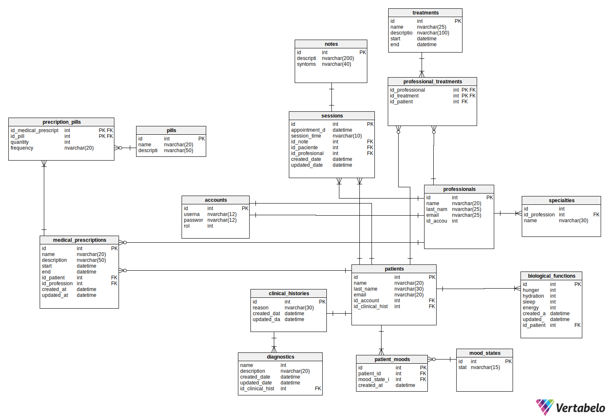

# **CAPÍTULO IV: PRODUCT DESIGN**
## 4.1. Style Guidelines
En esta sección, presentaremos el concepto de diseño para la página web y la aplicación, para proporcionar a nuestros usuarios una interfaz amigable y funcional. Con este propósito en mente, hemos optado por utilizar elementos visuales que sean fáciles de percibir y que resulten atractivos a la vista.
### 4.1.1. General Style Guidelines
Nuestra paleta de colores se ha seleccionado para proporcionar un entorno digital de apoyo a la salud mental y el bienestar, tanto para los psiquiatras como para sus pacientes. El objetivo principal de nuestra plataforma es crear un espacio donde la confianza, la claridad y la seguridad sean primordiales, asegurando que la interacción entre profesionales y pacientes sea fluida y efectiva. Este enfoque se refleja en la selección de colores, que buscan transmitir calma, confiabilidad y profesionalismo. A continuación, se presenta una breve descripción de los colores que se utilizarán en nuestra aplicación:

**Chromatic Colors:**

#10BEAE (Verde Vitalidad - Principal): Este verde vibrante es el color principal para gran parte de nuestro proyecto. Inspira renovación y energía positiva, reflejando la vitalidad y el bienestar que Psymed busca promover en sus usuarios. Este tono se utiliza para destacar elementos clave e inspirar confianza a lo largo de la experiencia del usuario.

  

#68D585 (Verde Serenidad): Este verde suave y sereno se utiliza para ciertos íconos, aportando una sensación de equilibrio y sutileza. Es un tono que complementa la paleta principal, ayudando a guiar visualmente al usuario sin distraer.

  

#081828 (Azul Profundo - Secundario): Este color azul oscuro se emplea como color secundario en botones, el pie de página y otros elementos visuales. Representa la estabilidad y la confianza, ofreciendo un contraste sólido y profesional frente a los tonos verdes más brillantes de la paleta.

  

**Achromatic Colors:**

#FFFFFF (Blanco Puro): El blanco es fundamental para los espacios en blanco y como color de fondo principal. Representa la pureza y la claridad, asegurando que el contenido sea fácilmente legible y que la interfaz se sienta abierta y acogedora.

  

#EEEEEE (Gris Suave): Un gris muy claro que se emplea en fondos y separadores. Ofrece una base limpia y ligera, perfecta para mantener una apariencia fresca y ordenada en la interfaz.

  

#727272 (Gris Equilibrio): Este tono de gris medio se utiliza para elementos secundarios y textos que requieren un enfoque sutil. Representa el equilibrio y la neutralidad, aportando un contraste suave sin dominar la atención visual.

  

#4F4F4F (Gris Profundo): Este gris oscuro se utiliza para textos y elementos gráficos que requieren mayor peso visual, sin llegar a la intensidad del negro. Es un color que transmite seriedad y formalidad, ideal para secciones importantes del proyecto.

  

#000000 (Negro Absoluto): El negro se reserva para elementos que necesitan el máximo contraste y definición, como el texto principal y ciertos íconos. Representa la autoridad y la claridad, garantizando la máxima legibilidad y enfoque.

  

**Typography: Sans Serif**

Para el proyecto Psymed, utilizaremos una fuente sans serif, que asegura una lectura clara y moderna. Dentro de esta categoría, emplearemos las variaciones de DM Sans y Spartan, ambas conocidas por su simplicidad y elegancia, ideales para mantener una estética limpia y profesional en todos los elementos textuales del sistema.

- **DM Sans - Sans Serif**

  

- **Spartan - Sans Serif**

  

**Icon:**

  

El ícono de Psymed presenta una flama estilizada en un fondo circular La flama simboliza la energía vital, el crecimiento y la transformación, reflejando el enfoque de Psymed en el bienestar mental y emocional. El fondo verde menta complementa esta idea, transmitiendo calma y equilibrio, alineado con los valores de cuidado y apoyo que representa la plataforma.

  

Este logo no solo representa la identidad visual de Psymed, sino que también encarna nuestra misión de brindar un espacio seguro, eficiente y accesible para la gestión de la salud mental.

### 4.1.2. Web Style Guidelines

Las Web Style Guidelines de PSYMED han sido desarrolladas con el objetivo de ofrecer una experiencia de usuario óptima y consistente en todos los dispositivos. Nuestra plataforma psiquiátrica está diseñada bajo los principios de Web Responsive Design, asegurando que cada elemento de la interfaz se ajuste fluidamente a diferentes tamaños de pantalla, desde dispositivos móviles hasta monitores de escritorio. 

Uno de los enfoques clave en el diseño de nuestra interfaz es la implementación del patrón de diseño en forma de Z. Este patrón guía intuitivamente el ojo del usuario a través de la página, comenzando desde la esquina superior izquierda, pasando por el contenido central y terminando en la esquina inferior derecha. Este flujo natural facilita la navegación, permitiendo que los usuarios accedan rápidamente a la información más importante, como diagnósticos, citas y seguimientos de síntomas. 

Nuestro diseño adaptable y el uso del patrón en Z garantizan que, independientemente del dispositivo utilizado, la experiencia de usuario sea fluida, intuitiva y centrada en las necesidades tanto de los médicos como de los pacientes. Estas directrices de estilo no solo definen la apariencia de PSYMED, sino que también refuerzan nuestra misión de proporcionar un entorno digital accesible y eficaz para la gestión de la salud mental. 

## 4.2. Information Architecture

Esta sección se enfoca en los elementos esenciales de contenido visual, estilos, etiquetas, y más, que se considerarán en el desarrollo de la web y la landing page. 

### 4.2.1. Organization Systems
Para asegurar una jerarquía clara y precisa en nuestra
aplicación, es crucial facilitar una navegación satisfactoria
para el usuario. La estructura que hemos definido es la
siguiente: 

**Medicos:**
Al acceder a la plataforma del proyecto para profesionales de la salud mental, los usuarios (psiquiatras, psicólogos y otros profesionales de la salud mental) pueden iniciar sesión, registrarse si no tienen una cuenta previa, o recuperar su contraseña en caso de olvido. Una vez autenticados, la página principal presenta un panel de control personalizado con un menú de navegación que incluye opciones como "Pacientes", "Agenda", "Perfil" y "Ajustes".

En la sección "Pacientes", los profesionales pueden ver una lista de sus pacientes actuales y seleccionar un paciente para acceder a su perfil detallado, que incluye historial de citas, notas clínicas por sesión y tratamientos en curso. En la opción de "Tratamientos en curso" se puede acceder a opciones tales como diagnósticos, datos fisiológicos, registro de estados de ánimo y tareas asignadas.

La opción "Agenda" ofrece una vista calendarizada de las citas programadas, con opciones para agendar nuevas consultas, modificar horarios y enviar recordatorios.

En el "Perfil", los profesionales pueden revisar y actualizar su información personal, incluyendo datos de contacto y especialidad. En la sección "Ajustes", pueden gestionar la seguridad de la cuenta, como cambiar contraseñas.

  

---
**Pacientes:**
Al acceder a la plataforma del proyecto para pacientes, los usuarios pueden iniciar sesión con su nombre y apellido, cambiar la contraseña, y una vez autenticados, la página principal presenta un panel de control personalizado con un menú de navegación que incluye opciones como "Perfil", "Citas", "Lista de Tareas" y "Tratamiento Actual".

En la sección "Lista de Tareas" se pueden visualizar los conjuntos de actividades designados por el profesional de la salud mental en cada sesión. Dentro de esta vista, se puede acceder a opciones tales como ver tareas y marcar como completadas.

En la sección "Tratamiento Actual" se puede acceder a opciones tales como "Prescripciones", "Diagnóstico Actual", "Formulario de Estados de Ánimo", "Registro de Estados Fisiológicos" y ver datos estadísticos de su estado a lo largo del tratamiento.

En la sección "Citas" se pueden visualizar las citas programadas por el profesional de la salud mental, y se puede acceder a opciones tales como ver detalles de la cita.

En la sección "Perfil" se puede visualizar y actualizar la información personal del paciente, incluyendo datos de contacto y datos de salud.

  

### 4.2.2. Labeling Systems

- **Profesionales de la Salud Mental**
<table>
  <thead>
    <tr>
      <td colspan="3">Profesionales</td>
    </tr>
  </thead>
  <tbody>
    <tr>
      <td><strong>Inicio</strong></td>
      <td>
        <ul>
          <li>Iniciar sesión</li>
          <li>Registrarse</li>
          <li>Recuperar su contraseña</li>
        </ul>
      </td>
    </tr>
    <tr>
      <td><strong>Página principal</strong></td>
      <td>
        <ul>
          <li>Pacientes</li>
          <li>Agenda</li>
          <li>Perfil</li>
          <li>Ajustes</li>
        </ul>
      </td>
    </tr>
    <tr>
      <td><strong>Pacientes y Lista de sus pacientes</strong></td>
      <td>
        <ul>
          <li>Historial de citas</li>
          <li>Notas clínicas por sesión</li>
          <li>Tratamientos en curso
            <ul>
              <li>Diagnósticos</li>
              <li>Datos fisiológicos</li>
              <li>Registro de estados de ánimo</li>
              <li>Tareas asignadas</li>
              <li>Asignar Medicamentos</li>
            </ul>
          </li>
        </ul>
      </td>
    </tr>
    <tr>
      <td><strong>Agenda</strong></td>
      <td>
        <ul>
          <li>Agendar una nueva consulta</li>
          <li>Modificar horarios</li>
          <li>Enviar recordatorios</li>
        </ul>
      </td>
    </tr>
    <tr>
      <td><strong>Perfil</strong></td>
      <td>
        <ul>
          <li>Datos del contacto</li>
          <li>Especialidad</li>
        </ul>
      </td>
    </tr>
    <tr>
      <td><strong>Ajustes</strong></td>
      <td>
        <ul>
          <li>Cambiar contraseña</li>
        </ul>
      </td>
    </tr>
  </tbody>
</table>

---
- **Pacientes:**

<table>
  <thead>
    <tr>
      <td colspan="3">Pacientes</td>
    </tr>
  </thead>
  <tbody>
    <tr>
      <td><strong>Inicio</strong></td>
      <td>
        <ul>
          <li>Iniciar sesión</li>
          <li>Cambiar contraseña</li>
        </ul>
      </td>
    </tr>
    <tr>
      <td><strong>Página principal</strong></td>
      <td>
        <ul>
          <li>Perfil</li>
          <li>Citas</li>
          <li>Lista de tareas</li>
          <li>Tratamiento actual</li>
        </ul>
      </td>
    </tr>
    <tr>
      <td><strong>Perfil</strong></td>
      <td>
        <ul>
          <li>Datos del contacto</li>
          <li>Datos de salud</li>
        </ul>
      </td>
    </tr>
    <tr>
      <td><strong>Citas</strong></td>
      <td>
        <ul>
          <li>Ver detalles de la cita</li>
        </ul>
      </td>
    </tr>
    <tr>
      <td><strong>Lista de tareas</strong></td>
      <td>
        <ul>
          <li>Ver tareas</li>
          <li>Marcar como completados</li>
        </ul>
      </td>
    </tr> 
    <tr>
      <td><strong>Tratamiento actual</strong></td>
      <td>
        <ul>
          <li>Registro de medicamentos</li>
          <li>Diagnóstico actual</li>
          <li>Formulario de estados de ánimo
            <ul>
              <li>Registro de estados fisiológicos</li>
              <li>Ver datos estadísticos de su estado a lo largo del tratamiento</li>
            </ul>
          </li>
        </ul>
      </td>
    </tr>
  </tbody>
</table>

### 4.2.3. SEO Tags and Meta Tags
Las etiquetas reflejan el contenido de nuestro proyecto, abarcando tanto la Landing Page como el Sitio Web. Han sido creadas para mejorar la visibilidad de nuestro proyecto en los principales motores de búsqueda, lo que permitirá a los usuarios encontrar fácilmente nuestra aplicacion de PSYMED.

Para la landing page:
- **Título:** PSYMED - Plataforma de Gestión de Salud Mental
- **Descripción:** PSYMED - plataforma de gestión de salud mental - LandingPage.
- **keywords:** Salud Mental, Psiquiatras, Software, Citas Médicas, Historial Clínico, Plataforma Psicólogos, Registro Pacientes, Tratamiento Psicológico, Seguimiento Pacientes.
- **Author:** closedSource

Para el Web Side:

- **Título:** PSYMED - Plataforma de Gestión de Salud Mental
- **Descripción:** PSYMED - plataforma de gestión de salud mental - Web Side.
- **keywords:** Salud Mental, Psiquiatras, Software, Citas Médicas, Historial Clínico, Plataforma Psicólogos, Registro Pacientes, Tratamiento Psicológico, Seguimiento Pacientes.
- **Author:** closedSource

### 4.2.4. Searching Systems
Los médicos pueden utilizar los métodos de búsqueda por:

- Filtrado de Información por Fechas:
  - Búsqueda de notas por fecha
  - Búsqueda de sesiones por fecha
  - Búsqueda de diagnósticos por fecha
  - Búsqueda de prescripciones por fecha
  - Ver sesiones por fecha

Los pacientes pueden utilizar los methods de búsqueda por:
- Filtrado de información por ID
  - búsqueda de tareas por ID
  - confirmation de tareas por ID

### 4.2.5. Navigation Systems

**Para Psiquiatras:**

En la plataforma para profesionales de salud mental, tras iniciar sesión, los usuarios acceden a un panel de control con un menú superior que incluye "Inicio", "Pacientes", "Agenda", "Perfil" y "Ajustes". En "Pacientes", pueden ver y gestionar perfiles detallados de los pacientes, incluyendo historial de citas y tratamientos. "Agenda" muestra un calendario con citas programadas y permite agendar nuevas, modificar horarios y enviar recordatorios. En "Perfil", se actualiza la información personal y en "Ajustes", se gestionan aspectos de seguridad de la cuenta.

**Para Pacientes:**

Al ingresar, los pacientes ven un panel con opciones como "Inicio", "Perfil", "Citas", "Lista de Tareas" y "Tratamiento Actual". En "Lista de Tareas", pueden ver y marcar tareas asignadas como completadas. "Tratamiento Actual" ofrece detalles sobre prescripciones, diagnósticos, estados de ánimo y datos estadísticos. "Citas" permite ver y gestionar citas programadas, mientras que "Perfil" facilita la actualización de la información personal.

Este sistema asegura un acceso rápido y sencillo a las funciones y datos clave tanto para psiquiatras como para pacientes.

## 4.3. Landing Page UI Design
### 4.3.1. Landing Page Wireframe
- **Desktop - Wireframes:**

  

- **Mobile - Wireframes:**

  

### 4.3.2. Landing Page Mock-up
- **Desktop - Mockups:**

  
  
  

- **Mobile - Mockups:**

   
   
   
   
   
   
   
   
   
   
   
   
   
  

## 4.4. Web Applications UX/UI Design
### 4.4.1. Web Applications Wireframes
**Wireframe del Home:**

**Wireframe del Register:**

**Wireframe del Login:**

**Wireframe del Cambio de Contraseña:**

**Wireframe del Home Psiquiatras**

**Wireframe del Perfil**

**Wireframe del Agregar Pacientes**

**Wireframe del Lista Pacientes**

**Wireframe del Configuracion de Pacientes**

**Wireframe del Citas**

**Wireframe del Agenda**

**Wireframe del Citas**

**Wireframe del Datos del Paciente**

**Wireframe de la lista**

**Wireframe del Test Interdiario**

### 4.4.2. Web Applications Wireflow Diagrams

### 4.4.2. Web Applications Mock-ups

**MockUp del Home:**

**MockUp del Register:**

**MockUp del Login:**

**MockUp del Cambio de Contraseña:**

**MockUp del Home Psiquiatras**

**MockUp del Perfil**

**MockUp del Agregar Pacientes**

**MockUp del Lista Pacientes**

**MockUp del Configuracion de Pacientes**

**MockUp del Citas**

**MockUp del Agenda**

**MockUp del Citas**

**MockUp del Datos del Paciente**

**MockUp de la lista**

**MockUp del Test Interdiario**

### 4.4.3. Web Applications User Flow Diagrams

## 4.5. Web Applications Prototyping

### 4.6.1. Software Architecture Context Diagram

#### System Context Diagram

### 4.6.1. Software Architecture Context Diagram.

### 4.6.2. Software Architecture Container Diagrams.

### 4.6.3. Software Architecture Components Diagrams.

## 4.7. Software Object-Oriented Design.

### 4.7.1. Class Diagrams.
La siguiente imagen representa el diagrama de clases, junto con la relación entre clases en función al proyecto.

  

A continuación, una descripción detallada de las tablas y relaciones en la base de datos:

- **patients (pacientes):**
  - **id:** Identificador único del paciente (PK).
  - **name, last_name, email:** Información básica del paciente.
  - **id_account:** Relación con la tabla accounts (FK).
  - **id_clinical_history:** Relación con la tabla clinical_histories (FK).

 

- **accounts (cuentas):**
  - **id:** Identificador único de la cuenta (PK).
  - **username, password:** Credenciales de acceso del usuario.
  - **rol:** Rol asignado al usuario.

 

- **clinical_histories (historias clínicas):**
  - **id:** Identificador único de la historia clínica (PK).
  - **reason:** Razón o motivo de la historia clínica.
  - **created_date, updated_date:** Fechas de creación y actualización.
  - **id_patient:** Relación con la tabla patients (FK).

 

- **diagnostics (diagnósticos):**
  - **id:** Identificador único del diagnóstico (PK).
  - **name, description:** Nombre y descripción del diagnóstico.
  - **created_date, updated_date:** Fechas de creación y actualización.
  - **id_clinical_history:** Relación con la tabla clinical_histories (FK).

 

- **sessions (sesiones):**
  - **id:** Identificador único de la sesión (PK).
  - **appointment_date, session_time:** Fecha y hora de la cita.
  - **id_note:** Relación con la tabla notes (FK).
  - **id_patient, id_professional:** Relaciones con las tablas patients y professionals (FKs).
  - **created_date, updated_date:** Fechas de creación y actualización.

 
   
- **notes (notas):**
  - **id:** Identificador único de la nota (PK).
  - **description, symptoms:** Descripción y síntomas registrados en la nota.

 

- **professionals (profesionales):**
  - **id:** Identificador único del profesional (PK).
  - **name, last_name, email:** Información básica del profesional.
  - **id_account:** Relación con la tabla accounts (FK).

 

- **specialties (especialidades):**
  - **id:** Identificador único de la especialidad (PK).
  - **id_profession:** Relación con la tabla professionals (FK).
  - **name:** Nombre de la especialidad.

 

- **treatments (tratamientos):**
  - **id:** Identificador único del tratamiento (PK).
  - **name, description:** Nombre y descripción del tratamiento.
  - **start, end:** Fechas de inicio y fin del tratamiento.

 

- **professional_treatments (tratamientos profesionales):**
  - **id_professional, id_treatment, id_patient:** Relaciones entre profesionales, tratamientos y pacientes (PKs y FKs).

 

- **medical_prescriptions (prescripciones médicas):**
  - **id:** Identificador único de la prescripción médica (PK).
  - **name, description:** Nombre y descripción de la prescripción.
  - **start, end:** Fechas de inicio y fin de la prescripción.
  - **id_patient, id_professional:** Relaciones con las tablas patients y professionals (FKs).
  - **created_at, updated_at:** Fechas de creación y actualización.

 

- **prescription_pills (píldoras prescritas):**
  - **id_medical_prescription, id_pill:** Relación entre prescripciones médicas y píldoras (PKs y FKs).
  - **quantity, frequency:** Cantidad y frecuencia de la administración de la píldora.

 

- **pills (píldoras):**
  - **id:** Identificador único de la píldora (PK).
  - **name, description:** Nombre y descripción de la píldora.
  
 

- **biological_functions (funciones biológicas):**
  - **id:** Identificador único de la función biológica (PK).
  - **hunger, hydration, sleep, energy:** Funciones biológicas relacionadas con el paciente.
  - **created_at, updated_at:** Fechas de creación y actualización.
  - **id_patient:** Relación con la tabla patients (FK).

 

- **mood_states (estados de ánimo):**
  - **id:** Identificador único del estado de ánimo (PK).
  - **state:** Estado de ánimo del paciente.

 

- **patient_moods (estados de ánimo del paciente):**
  - **id:** Identificador único del estado de ánimo del paciente (PK).
  - **id_patient:** Relación con la tabla patients (FK).
  - **mood_state_id:** Relación con la tabla mood_states (FK).
  - **created_at:** Fecha de creación del registro.
### 4.7.2. Class Dictionary.

<table border="1">
  <tr>
    <th colspan="1">#</th>
    <th colspan="2">Entidad</th>
    <th colspan="2">Nombre de atributos</th>
    <th colspan="4">Definición</th>
    <th colspan="2">Tipo de dato</th>
  </tr>
  <tr>
    <td rowspan="3" colspan="1">1</td>
    <td rowspan="3" colspan="2">Patient</td>
    <td colspan="2">id</td>
    <td colspan="4">Identificador del paciente</td>
    <td colspan="2">int</td>
  </tr>
  <tr>
    <td colspan="2">clinicalHistory</td>
    <td colspan="4">Historia clínica del paciente</td>
    <td colspan="2">String</td>
  </tr>
  <tr>
    <td colspan="2">treatmentPlan</td>
    <td colspan="4">Plan de tratamiento del paciente</td>
    <td colspan="2">TreatmentPlan</td>
  </tr>
  <tr>
    <td rowspan="3" colspan="1">2</td>
    <td rowspan="3" colspan="2">TreatmentPlan</td>
    <td colspan="2">biologicalFunctions</td>
    <td colspan="4">Funciones biológicas del paciente</td>
    <td colspan="2">List<BiologicalFunction></td>
  </tr>
  <tr>
    <td colspan="2">treatmentTasks</td>
    <td colspan="4">Tareas del tratamiento</td>
    <td colspan="2">List<TreatmentTask></td>
  </tr>
  <tr>
    <td colspan="2">diagnosis</td>
    <td colspan="4">Diagnóstico del paciente</td>
    <td colspan="2">Diagnosis</td>
  </tr>
  <tr>
    <td rowspan="2" colspan="1">3</td>
    <td rowspan="2" colspan="2">Diagnosis</td>
    <td colspan="2">name</td>
    <td colspan="4">Nombre del diagnóstico</td>
    <td colspan="2">String</td>
  </tr>
  <tr>
    <td colspan="2">code</td>
    <td colspan="4">Código del diagnóstico</td>
    <td colspan="2">int</td>
  </tr>
  <tr>
    <td rowspan="2" colspan="1">4</td>
    <td rowspan="2" colspan="2">BiologicalFunction</td>
    <td colspan="2">hunger</td>
    <td colspan="4">Nivel de hambre del paciente</td>
    <td colspan="2">int</td>
  </tr>
  <tr>
    <td colspan="2">thirst</td>
    <td colspan="4">Nivel de sed del paciente</td>
    <td colspan="2">int</td>
  </tr>
  <tr>
    <td rowspan="3" colspan="1">5</td>
    <td rowspan="3" colspan="2">TreatmentTask</td>
    <td colspan="2">id</td>
    <td colspan="4">Identificador de la tarea de tratamiento</td>
    <td colspan="2">int</td>
  </tr>
  <tr>
    <td colspan="2">name</td>
    <td colspan="4">Nombre de la tarea</td>
    <td colspan="2">String</td>
  </tr>
  <tr>
    <td colspan="2">completionStatus</td>
    <td colspan="4">Estado de la tarea</td>
    <td colspan="2">bool</td>
  </tr>
  <tr>
    <td rowspan="2" colspan="1">6</td>
    <td rowspan="2" colspan="2">Professional</td>
    <td colspan="2">id</td>
    <td colspan="4">Identificador del profesional</td>
    <td colspan="2">int</td>
  </tr>
  <tr>
    <td colspan="2">patients</td>
    <td colspan="4">Lista de pacientes asignados</td>
    <td colspan="2">List<Patient></td>
  </tr>
  <tr>
    <td rowspan="3" colspan="1">7</td>
    <td rowspan="3" colspan="2">User</td>
    <td colspan="2">id</td>
    <td colspan="4">Identificador del usuario</td>
    <td colspan="2">int</td>
  </tr>
  <tr>
    <td colspan="2">name</td>
    <td colspan="4">Nombre del usuario</td>
    <td colspan="2">String</td>
  </tr>
  <tr>
    <td colspan="2">email</td>
    <td colspan="4">Correo electrónico del usuario</td>
    <td colspan="2">String</td>
  </tr>
</table>

## 4.8. Database Design.

La elección del sistema de gestión de bases de datos (DBMS) adecuado es crucial para el éxito de cualquier proyecto. En esta comparación, vamos a analizar tres de los sistemas de gestión de bases de datos más populares: MongoDB, SQL Server y MySQL. Cada sistema tiene sus características, fortalezas y debilidades en rendimiento, escalabilidad, seguridad, y facilidad de uso. Este análisis ayudará a determinar cuál es el más adecuado para un proyecto específico.

<table>
  <thead>
    <tr>
      <th>Base de Datos</th>
      <th>Ventajas</th>
      <th>Desventajas</th>
    </tr>
  </thead>
  <tbody>
    <tr>
      <td style="text-align: center;">
        
      </td>
      <td>
        <ul>
          <li>Software de código abierto con gran comunidad de soporte.</li>
          <li>Alta compatibilidad con diversos entornos y plataformas.</li>
          <li>Desempeño sólido en aplicaciones web y sistemas de gestión de contenido.</li>
        </ul>
      </td>
      <td>
        <ul>
          <li>Limitaciones en el manejo de grandes volúmenes de datos complejos.</li>
          <li>Menos características avanzadas en comparación con Microsoft SQL Server.</li>
          <li>Opciones de escalabilidad limitadas en comparación con MongoDB.</li>
        </ul>
      </td>
    </tr>
    <tr>
      <td style="text-align: center;">
        
      </td>
      <td>
        <ul>
          <li>Altamente integrado con productos y servicios de Microsoft.</li>
          <li>Potentes herramientas de análisis y optimización de rendimiento.</li>
          <li>Amplias características de seguridad, incluidas auditorías y cifrado de datos.</li>
          <li>Excelente soporte para transacciones y alta disponibilidad.</li>
        </ul>
      </td>
      <td>
        <ul>
          <li>Costo elevado de licencias, especialmente para grandes implementaciones.</li>
          <li>Mayor consumo de recursos en comparación con MySQL.</li>
          <li>Curva de aprendizaje más pronunciada debido a su complejidad.</li>
        </ul>
      </td>
    </tr>
    <tr>
      <td style="text-align: center;">
        
      </td>
      <td>
        <ul>
          <li>Modelo flexible de datos NoSQL, ideal para documentos y JSON.</li>
          <li>Escalabilidad horizontal fácil, ideal para grandes volúmenes de datos.</li>
          <li>Alto rendimiento en operaciones de lectura/escritura masivas.</li>
        </ul>
      </td>
      <td>
        <ul>
          <li>Falta de soporte nativo para transacciones complejas.</li>
          <li>Menos maduro en términos de seguridad y respaldo de datos en comparación con SQL Server.</li>
          <li>No es ideal para aplicaciones que requieren relaciones complejas entre datos.</li>
        </ul>
      </td>
    </tr>
  </tbody>
</table>

Usar Microsoft SQL Server para nuestro proyecto de diseño de base de datos puede ser una excelente elección por varias razones. SQL Server es conocido por su confiabilidad, seguridad y escalabilidad. Además, su integración con herramientas de desarrollo de Microsoft, como Visual Studio, puede facilitar el proceso de diseño y desarrollo.

  

Su soporte para lenguaje SQL estándar y su capacidad para manejar grandes volúmenes de datos también son puntos a favor. Además, cuenta con características avanzadas como replicación, alta disponibilidad y análisis integrado, lo que puede proporcionar una base sólida para proyectos de cualquier tamaño y complejidad.

### 4.8.1. Database Diagram.

A continuación el diagrama elaborado para la Base de Datos de Psymed.

  

