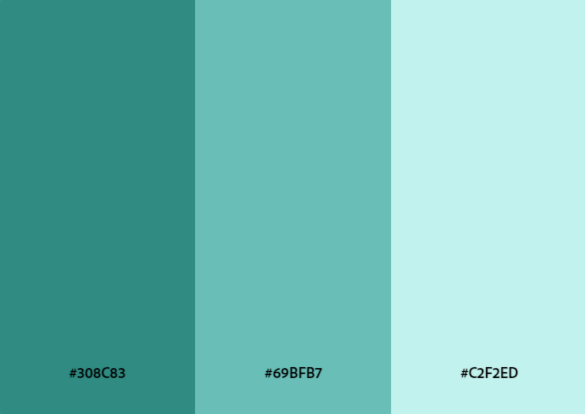
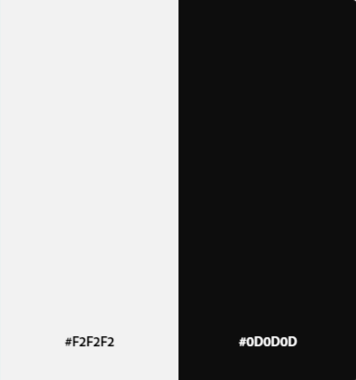
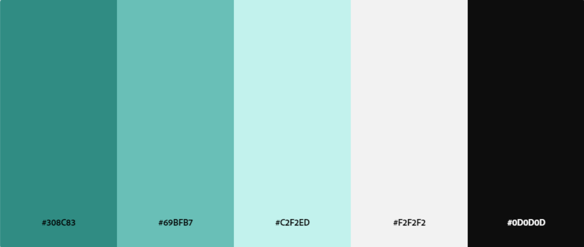
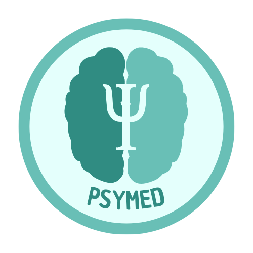
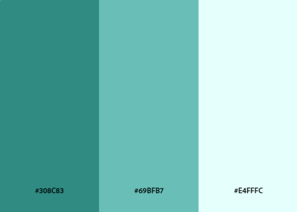

# **CAPÍTULO IV: PRODUCT DESING**
## 4.1. Style Guidelines
En esta sección, presentaremos el concepto de diseño para la página web y la aplicación, para proporcionar a nuestros usuarios una interfaz amigable y funcional. Con este propósito en mente, hemos optado por utilizar elementos visuales que sean fáciles de percibir y que resulten atractivos a la vista.
### 4.1.1. General Style Guidelines
Nuestra paleta de colores se ha seleccionado para proporcionar un entorno digital de apoyo a la salud mental y el bienestar, tanto para los psiquiatras como para sus pacientes. El objetivo principal de nuestra plataforma es crear un espacio donde la confianza, la claridad y la seguridad sean primordiales, asegurando que la interacción entre profesionales y pacientes sea fluida y efectiva. Este enfoque se refleja en la selección de colores, que buscan transmitir calma, confiabilidad y profesionalismo. A continuación, se presenta una breve descripción de los colores que se utilizarán en nuestra aplicación:

**Chromatic Colors:**

#308C83 (Teal Profundo): Este color actúa como el tono principal de la plataforma, evocando tranquilidad y estabilidad, cualidades esenciales en el ámbito de la salud mental. Es ideal para encabezados, botones de acción y elementos que requieren destacar, asegurando que el profesional pueda navegar y tomar decisiones de manera confiable.

#69BFB7 (Teal Suave): Utilizado para elementos secundarios y destacados sutiles, este tono complementa el color primario, aportando una sensación de frescura y modernidad, sin desviar la atención de la información crítica. Es ideal para secciones como el registro de síntomas y la visualización de citas.

#C2F2ED (Aqua Ligero): Este color se utilizará principalmente en los fondos y áreas extensas, proporcionando un entorno relajante y libre de distracciones. Su suavidad ayuda a reducir la carga visual, permitiendo que tanto los profesionales como los pacientes se concentren en el contenido relevante, como los signos vitales y comentarios diarios.

  

**Achromatic Colors:**

#F2F2F2 (Gris Claro): Este tono neutro es ideal para separar y organizar la información de manera clara y ordenada. Se empleará en fondos y separadores, garantizando que los datos privados, como diagnósticos y medicaciones, sean fácilmente accesibles, pero visualmente discretos.

#0D0D0D (Negro Intenso): Utilizado principalmente para texto y detalles cruciales, este color asegura una máxima legibilidad y contraste. Es perfecto para mostrar información crítica como diagnósticos, medicación, y alertas de signos vitales, brindando al usuario una experiencia precisa y enfocada.

  

Estos colores no tienen una tonalidad cromática específica y están formados por variaciones de blanco, negro y grises. En esta paleta, el blanco, negro son ejemplos de colores acromáticos. Estos colores proporcionan equilibrio, contraste y neutralidad, sirviendo como base y permitiendo que los colores cromáticos destaquen.

**Color Pallette:**

  

**Typography: Montserrat**

Para nuestra plataforma, hemos elegido Montserrat como la tipografía principal, por su diseño moderno, limpio y altamente legible. Esta fuente nos permite presentar la información de manera clara y profesional, garantizando que tanto los psiquiatras como los pacientes puedan interactuar con la aplicación de forma intuitiva y sin esfuerzo.

Montserrat se utilizará para todos los textos de la plataforma, desde encabezados y títulos hasta cuerpos de texto y botones de acción. Su versatilidad en cuanto a pesos nos permitirá destacar la información crítica, mientras que su geometría precisa asegurará una experiencia de lectura cómoda y agradable en cualquier dispositivo.

Esta elección refuerza nuestro compromiso de ofrecer un entorno digital que no solo sea funcional, sino también estéticamente atractivo y accesible para todos los usuarios.

- **Scale:**
  - Base: El tamaño base es de 18px.
  - Ratio: Utilizaremos un ratio de escala (por ejemplo, 1.2) que definirá la relación entre los tamaños de texto, creando una jerarquía visual consistente y armoniosa en la aplicación.
  - Tipografía: Montserrat
  - Line Spacing (Espaciado entre líneas): Entre 1.4 y 1.6, dependiendo del tamaño de la fuente y el contexto de uso. Esto asegurará una legibilidad óptima, especialmente en textos más largos.
  
- **Nomenclature:**
  - Name / Size / Weights
  - Heading 0 / 22px / Medium
  - Heading 1 / 38px / Medium
  - Heading 2 / 34px / Medium
  - Heading 3 / 25px / Medium
  - Heading 4 / 22px / Medium
  - Base / 18px / Light
  - Body 1 / 10px / Regular

**Icon:**

  

El logo de PSYMED está diseñado para capturar la esencia de nuestra plataforma psiquiátrica, centrada en el cuidado y seguimiento integral de los pacientes. El emblema en forma de corazón, combinado con la figura humana en el centro, simboliza la conexión empática y el apoyo constante que ofrecemos entre médicos y pacientes.

  

Los tonos de teal reflejan calma, serenidad y profesionalismo, cualidades fundamentales en el ámbito de la salud mental. La tipografía utilizada en "PSYMED" es fuerte y moderna, transmitiendo seguridad y confiabilidad, mientras que el subtítulo "Psychiatric Platform" en un estilo más ligero, enfatiza la precisión y delicadeza con la que manejamos información crítica y personal.

Este logo no solo representa la identidad visual de PSYMED, sino que también encarna nuestra misión de brindar un espacio seguro, eficiente y accesible para la gestión de la salud mental.

### 4.1.2. Web Style Guidelines

Las Web Style Guidelines de PSYMED han sido desarrolladas con el objetivo de ofrecer una experiencia de usuario óptima y consistente en todos los dispositivos. Nuestra plataforma psiquiátrica está diseñada bajo los principios de Web Responsive Design, asegurando que cada elemento de la interfaz se ajuste fluidamente a diferentes tamaños de pantalla, desde dispositivos móviles hasta monitores de escritorio. 

Uno de los enfoques clave en el diseño de nuestra interfaz es la implementación del patrón de diseño en forma de Z. Este patrón guía intuitivamente el ojo del usuario a través de la página, comenzando desde la esquina superior izquierda, pasando por el contenido central y terminando en la esquina inferior derecha. Este flujo natural facilita la navegación, permitiendo que los usuarios accedan rápidamente a la información más importante, como diagnósticos, citas y seguimientos de síntomas. 

Nuestro diseño adaptable y el uso del patrón en Z garantizan que, independientemente del dispositivo utilizado, la experiencia de usuario sea fluida, intuitiva y centrada en las necesidades tanto de los médicos como de los pacientes. Estas directrices de estilo no solo definen la apariencia de PSYMED, sino que también refuerzan nuestra misión de proporcionar un entorno digital accesible y eficaz para la gestión de la salud mental. 

## 4.2. Information Architecture

Esta sección se enfoca en los elementos esenciales de contenido visual, estilos, etiquetas, y más, que se considerarán en el desarrollo de la web y la landing page. 

### 4.2.1. Organization Systems
Para asegurar una jerarquía clara y precisa en nuestra
aplicación, es crucial facilitar una navegación satisfactoria
para el usuario. La estructura que hemos definido es la
siguiente: 

**Medicos:**
Al acceder a la plataforma del proyecto para profesionales de la salud mental, los usuarios (psiquiatras, psicólogos y otros profesionales de la salud mental) pueden iniciar sesión, registrarse si no tienen una cuenta previa, o recuperar su contraseña en caso de olvido. Una vez autenticados, la página principal presenta un panel de control personalizado con un menú de navegación que incluye opciones como "Pacientes", "Agenda", "Perfil" y "Ajustes".

En la sección "Pacientes", los profesionales pueden ver una lista de sus pacientes actuales y seleccionar un paciente para acceder a su perfil detallado, que incluye historial de citas, notas clínicas por sesión y tratamientos en curso. En la opción de "Tratamientos en curso" se puede acceder a opciones tales como diagnósticos, datos fisiológicos, registro de estados de ánimo y tareas asignadas.

La opción "Agenda" ofrece una vista calendarizada de las citas programadas, con opciones para agendar nuevas consultas, modificar horarios y enviar recordatorios.

En el "Perfil", los profesionales pueden revisar y actualizar su información personal, incluyendo datos de contacto y especialidad. En la sección "Ajustes", pueden gestionar la seguridad de la cuenta, como cambiar contraseñas.

---
**Pacientes:**
Al acceder a la plataforma del proyecto para pacientes, los usuarios pueden iniciar sesión con su nombre y apellido, cambiar la contraseña, y una vez autenticados, la página principal presenta un panel de control personalizado con un menú de navegación que incluye opciones como "Perfil", "Citas", "Lista de Tareas" y "Tratamiento Actual".

En la sección "Lista de Tareas" se pueden visualizar los conjuntos de actividades designados por el profesional de la salud mental en cada sesión. Dentro de esta vista, se puede acceder a opciones tales como ver tareas y marcar como completadas.

En la sección "Tratamiento Actual" se puede acceder a opciones tales como "Prescripciones", "Diagnóstico Actual", "Formulario de Estados de Ánimo", "Registro de Estados Fisiológicos" y ver datos estadísticos de su estado a lo largo del tratamiento.

En la sección "Citas" se pueden visualizar las citas programadas por el profesional de la salud mental, y se puede acceder a opciones tales como ver detalles de la cita.

En la sección "Perfil" se puede visualizar y actualizar la información personal del paciente, incluyendo datos de contacto y datos de salud.

### 4.2.2. Labeling Systems

**Medicos:**

**inicio**
- Iniciar sesión
- Registrarse
- Recuperar su contraseña

**Pagina principal**
- Pacientes
- Agenda
- Perfil
- Ajustes

**Pacientes**
- lista de sus pacientes
  - Historial de citas
  - Notas clínicas por sesión
  - Tratamientos en curso
    - Diagnósticos
    - Datos fisiológicos
    - Registro de estados de ánimo
    - Tareas asignadas
    - Asignar Medicamentos

**Agenda:**
- Agendar nuevas consultas
- Modificar horarios
- Enviar recordatorios

**Perfil:**
- Datos de contacto
- Especialidad

**Ajustes:**
- Cambiar contraseñas

---
**Pacientes:**

**Inicio**
- Iniciar sesión
- Cambiar la contraseña

**Pagina principal**
- Perfil
- Citas
- Lista de Tareas
- Tratamiento Actual

**Perfil:**
- Datos de contacto
- Datos de salud

**Citas:**
- Ver detalles de la cita

**Lista de Tareas:**
- Ver tareas
- Marcar como completadas

**Tratamiento Actual:**
- Registro de Medicamentos
- Diagnóstico Actual
- Formulario de Estados de Ánimo
  - Registro de Estados Fisiológicos
  - Ver datos estadísticos de su estado a lo largo del tratamiento

### 4.2.3. SEO Tags and Meta Tags
Las etiquetas reflejan el contenido de nuestro proyecto, abarcando tanto la Landing Page como el Sitio Web. Han sido creadas para mejorar la visibilidad de nuestro proyecto en los principales motores de búsqueda, lo que permitirá a los usuarios encontrar fácilmente nuestra aplicacion de PSYMED.

Para la landing page:
- **Título:** PSYMED - Plataforma de Gestión de Salud Mental
- **Descripción:** PSYMED - plataforma de gestión de salud mental - LandingPage .
- **keywords:** Salud Mental,Psiquiatras, Software, Citas Médicas, Historial Clínico, Plataforma Psicólogos, Registro Pacientes, Tratamiento Psicológico, Seguimiento Pacientes.
- **Author:** closedSource

 para el Web Side:

- **Título:** PSYMED - Plataforma de Gestión de Salud Mental
- **Descripción:** PSYMED - plataforma de gestión de salud mental - Web Side .
- **keywords:** Salud Mental,Psiquiatras, Software, Citas Médicas, Historial Clínico, Plataforma Psicólogos, Registro Pacientes, Tratamiento Psicológico, Seguimiento Pacientes.
- **Author:** closedSource

### 4.2.4. Searching Systems

El sistema de búsqueda es un componente esencial de la plataforma PSYMED, diseñado para facilitar el acceso rápido a la información relevante. El sistema debe ser intuitivo, rápido y preciso, permitiendo a los usuarios encontrar fácilmente lo que necesitan.

### Características del Sistema de Búsqueda:

- **Barra de Búsqueda:** Ubicada de manera prominente en la parte superior de la página, permitiendo a los usuarios ingresar palabras clave para buscar contenido específico.

- **Búsqueda Predictiva:** A medida que los usuarios escriben, el sistema debe sugerir términos relacionados o resultados potenciales para facilitar la búsqueda.

- **Filtros de Búsqueda:** Permitir a los usuarios filtrar resultados por categorías como "Planes de Suscripción", "Testimonios", "Artículos", "Contacto", etc.

- **Búsqueda Avanzada:** Ofrecer una opción de búsqueda avanzada donde los usuarios puedan especificar criterios más detallados para obtener resultados más precisos.

- **Indexación de Contenidos:** Asegurar que todos los contenidos de la plataforma estén indexados para una rápida recuperación durante la búsqueda.

### 4.2.5. Navigation Systems

El sistema de navegación de PSYMED está diseñado para ser simple, claro y eficiente, permitiendo a los usuarios moverse a través de la plataforma con facilidad. Un sistema de navegación bien diseñado mejora la experiencia del usuario al facilitar el acceso a la información y reducir el tiempo que se necesita para encontrarla.

### Características del Sistema de Navegación:

- **Menú Principal:** Ubicado en la parte superior de la página, el menú principal incluye enlaces directos a las secciones más importantes como "Home", "Suscripciones", "Testimonios", "Contacto" y "Log In".

- **Submenús Desplegables:** Permiten a los usuarios acceder a subsecciones específicas sin salir de la página actual. Por ejemplo, en "Suscripciones", los usuarios pueden acceder directamente a "Detalles del Plan".

## 4.3. Landing Page UI Design
### 4.3.1. Landing Page Wireframe
### 4.3.2. Landing Page Mock-up

## 4.4. Web Applications UX/UI Design
### 4.4.1. Web Applications Wireframes
### 4.4.2. Web Applications Wireflow Diagrams
### 4.4.2. Web Applications Mock-ups
### 4.4.3. Web Applications User Flow Diagrams

## 4.5. Web Applications Prototyping 