

# Capítulo V: Product Implementation, Validation & Deployment

## 5.1 Software Configuration Management

### 5.1.1. Software Development Environment Configuration.
En esta sección se describe las herramientas de software que utilizamos para colaborar en el ciclo de vida del proyecto de software.

#### Project Management:

- **Producto:** Trello.
- **Propósito:** Para gestión de tareas del equipo, asignación de roles, seguimiento del progreso de las funcionalidades del sistema, y planificación de entregables a través de tableros.
- **Ruta:** [trello](https://trello.com/invite/b/66c7b03600da2cf712927e84/ATTIbadabe6159d90d2f615ab9ae602eb3763DC0AF14/app-web)

#### Product UX/UI Design:

- **Producto:** Figma.
- **Propósito:** Para diseños (Wireframes, MockUps, Prototypes, etc) relacionados al proyecto.
- **Ruta:** [Figma](https://www.figma.com/design/WdMYexswCo2IFZE3tdsAJs/Open-Source-y-App-Web?node-id=2001-1221&t=NsBDNsyVTo1BXrXE-1)

#### Software Development:
- **Producto:** Webstorm.
- **Propósito:** Para desarrollar el Landing Page del proyecto.
- **Ruta:** [LandingPage](https://aplicaciones-webs-grupo04.github.io/Landing-Page_AppsWebs/)

#### Software Documentation:

- **Producto:** IntelliJ IDEA Ultimate.
- **Propósito:** Para la documentación del proyecto se utilizó IntelliJ IDEA y los capítulos en formato Markdown.
- **Ruta:** [IntelliJ IDEA](https://github.com/Aplicaciones-Webs-Grupo04/Report-AppsWebs.git)

### 5.1.2. Source Code Management.

Landing Page Repository: [Landing Page Repository](https://github.com/Aplicaciones-Webs-Grupo04/Landing-Page_AppsWebs)
- #### GitFlow Implementation:
Para implementar el flujo de trabajo Gitflow utilizando Git como nuestra herramienta de control de versiones, nos basamos en la entrada de blog "A successful Git branching model" de Vincent Driessen. Esta referencia nos permitió establecer las convenciones detalladas que serán aplicadas en nuestro proyecto

### **Master o Main branch**
La rama principal de desarrollo del proyecto es la Master branch. En esta rama reside el código que actualmente se encuentra en producción.
#### Notación: master o main

### **Develop branch**
La rama "Develop" albergará las más recientes actualizaciones y cambios agregados que serán incluidos en la próxima versión del proyecto. Esta rama sirve como un espacio para la integración y prueba continua de los cambios antes de ser fusionados con la rama principal "Master" para su despliegue en producción.
#### Notación: develop

### **Release branch**
La rama de lanzamiento (Release branch) facilitará la preparación de una nueva versión del producto. Esta rama permitirá la corrección de errores y permitirá que la rama Develop reciba más actualizaciones.
 Debe derivarse de la rama Develop.
 Debe fusionarse con la rama Develop y Master.
#### Notación: release

### **Feature branch**
Las ramas de características (Feature branches) serán empleadas para desarrollar nuevas funcionalidades o características del producto que se agregarán en la siguiente versión o en versiones futuras. Estas funcionalidades deberán fusionarse eventualmente con la rama Develop.
 Debe derivarse de la rama Develop.
 Debe fusionarse de vuelta a la rama Develop.
#### Notación: release

### **Hotfix branch**
La rama de corrección rápida (Hotfix branch) se empleará para resolver y actuar de manera inmediata ante posibles errores en la versión en producción del producto. La característica principal de esta rama es que permite preparar una solución rápida mientras el resto del equipo continúa trabajando en otras funcionalidades o mejoras.
 Debe derivarse de la rama Master
 Debe fusionarse con la rama Develop y Master
#### Notación: hotfix

### **Conventional Commits**
"Conventional Commits" es una convención para estructurar los mensajes de confirmación (commits) en un formato estándar y semántico. Este formato ayuda a comunicar claramente los cambios realizados en el código y facilita la generación de registros de cambios automáticos. Los "Conventional Commits" suelen seguir un formato que incluye un encabezado, un cuerpo opcional y un pie de página opcional, y se utilizan para describir de manera sucinta y clara los cambios realizados en el código, lo que facilita su seguimiento y comprensión por parte de los desarrolladores y otros miembros del equipo.
 
La estructura de un commit debe seguir las siguientes pautas:
~~~
git commit -m “<type>[optional scope]: <title>“ -m “<description”
~~~
**Tipos De Conventional Commits**
~~~
1. **feat**: Se usa para describir una nueva característica o funcionalidad añadida al código.
2. **fix**: Indica una corrección de errores o solución a un problema.
3. **docs**: Se emplea para cambios o mejoras en la documentación del código.
4. **style**: Describe cambios relacionados con el formato del código, como espacios en blanco, sangrías, etc., que no afectan su funcionalidad.
5. **refactor**: Se utiliza para modificaciones en el código que no corrigen errores ni añaden nuevas funcionalidades, sino que mejoran su estructura o legibilidad.
6. **test**: Indica la adición o modificación de pruebas unitarias o funcionales.
7. **chore**: Se usa para cambios en el proceso de construcción o tareas de mantenimiento que no están directamente relacionadas con el código en sí.
8. **perf**: Describe mejoras de rendimiento en el código.
~~~

### 5.1.3. Source Code Style Guide & Conventions.

Como norma general, se espera que todo el código desarrollado por los miembros del equipo esté completamente redactado en inglés.
- ### HTML
    - #### Use Lowercase Element Names:
      Es recomendable utilizar minúsculas o lowercase para los nombres de los elementos HTML.
        ~~~ 
      <body>
            
Esto es un párrafo

      <body>
       ~~~
    - #### Close All HTML Elements:
      Es recomendable cerrar todos los elementos HTML correctamente.
        ~~~ 
      <body>
            
Esto es un párrafo

            
Esto es otro párrafo

      <body>
       ~~~
    - #### Use Lowercase Attribute Names:
      Es recomendable utilizar minúsculas para los nombres de los atributos HTML.
      ~~~ 
      <a href="https://www.w3schools.com/html/">Visit our HTMLtutorial</a>
       ~~~
    - #### Always Specify alt, width, and height for Images:
      Es recomendable seguir estas convenciones en caso de que la imagen no se pueda mostrar, lo que ayuda a mejorar la accesibilidad del contenido.
      ~~~ 
      
      ~~~ 
    - #### Spaces and Equal Signs:
      Se recomienda no utilizar espacios en blanco entre las entidades para mejorar la legibilidad.
      ~~~ 
      <link rel="stylesheet" href="styles.css">
      ~~~ 
- ### CSS
    - #### ID and Class Naming
      Es recomendable utilizar nombres de clases y IDs significativos que expresen claramente el propósito del elemento.
      ~~~ 
      #gallery {}
      #login {}
      .video {}
       ~~~
    - #### ID and Class Name Style
      Se recomienda utilizar nombres cortos para nombrar IDs o clases, pero lo suficientemente descriptivos para entender su propósito.
      ~~~ 
      #nav {}
      .author {}
      ~~~
    - #### Shorthand Properties
      Se recomienda utilizar propiedades CSS de forma abreviada siempre que sea posible para hacer el código más eficiente y comprensible.
       ~~~ 
       border-top: 0;
       font: 100%/1.6 palatino, georgia, serif;
       padding: 0 1em 2em;
       ~~~ 
    - #### 0 and Units
      Es recomendable evitar especificar la unidad después del valor 0 en propiedades que lo permitan, ya que esto ayuda a reducir el tamaño del código y mejora su legibilidad.
       ~~~ 
       margin: 0;
       padding: 0;
       ~~~
    - #### Declaration Order
      Se recomienda ordenar las declaraciones en orden alfabético para facilitar el mantenimiento y la recordación del código.
      ~~~ 
       background: fuchsia;
       border: 1px solid;
       border-radius: 4px;
       color: black;
       text-align: center;
       text-indent: 2em;
      ~~~  
- ### JAVASCRIPT
    - #### Use expanded syntax
      Cada línea de JavaScript debería estar en una nueva línea, con la llave de apertura en la misma línea de su declaración y la llave de cierre en una nueva línea al final.
      ~~~ 
      function myFunc() {
       console.log('Hello!');
      };
      ~~~
    - #### Variable naming
      Para el nombre de las variables, se recomienda utilizar lowerCamelCase.
      ~~~ 
      let playerScore = 0;
      let speed = distance / time;
      ~~~  
    - #### Declaring variables
      Para la declaración de variables, es recomendable utilizar las palabras reservadas let y const en lugar de var.
      ~~~ 
      const myName = 'Chris';
      console.log(myName);
      let myAge = '40';
      myAge++;
      console.log('Happy birthday!');
      ~~~ 
    - #### Function naming
      Para el nombre de las funciones, se recomienda utilizar lowerCamelCase.
      ~~~ 
      function sayHello() {
      alert('Hello!');
      };
      ~~~ 
- ### C#
    - #### PascalCase
      Mayúscula al principio de cada palabra para nombres de clases y métodos.
      ~~~ 
      public class MiClase {
          public void MetodoEjemplo() {
              // Código del método
          }
      }
      ~~~
    - #### camelCase
      Minúscula al principio con mayúsculas para cada palabra subsiguiente para variables y parámetros.
      ~~~ 
      public class MiClase {
          public void MetodoEjemplo(int numeroEjemplo) {
              string nombreEjemplo = "Ejemplo";
              // Código del método      
          }
      }
      ~~~
    - #### Reasonable line length
      Mantener líneas de código con longitud adecuada para mejorar la legibilidad.
      ~~~ 
      public class MiClase {
          public void MetodoEjemplo() {
              string mensaje = "Este es un mensaje de ejemplo que ocupa varias líneas " +
                               "para demostrar cómo mantener una longitud razonable.";
               Console.WriteLine(mensaje);  
        }
      }
      ~~~ 
    - #### Clear comments:
      Utilizar comentarios para explicar el propósito del código de manera concisa.
      ~~~ 
      public class MiClase {
      // Este método realiza una operación de suma y retorna el resultado.
      public int Sumar(int a, int b) {
      return a + b;
      }
      }
      ~~~
    - #### Single responsibility:
      Cada clase o método debe tener una única función bien definida.
      ~~~ 
      // Clase responsable de manejar operaciones matemáticas básicas
      public class OperacionesMatematicas { 
          // Método para sumar dos números 
          public int Sumar(int a, int b) { 
              return a + b; 
          } 
       
          // Método para restar dos números 
          public int Restar(int a, int b) { 
              return a - b; 
          } 
      }
      ~~~
- ### LENGUAJE GHERKIN
    - #### Descriptive and concise titles for scenarios
      Utilizar títulos descriptivos y concisos para los escenarios.
      ~~~ 
      Feature: Login
        Scenario: Successful login
          Given a user is on the login page     
          When they enter valid credentials     
          Then they should be logged in successfully      
      ~~~
    - #### Follow the Given-When-Then structure consistently.
      Seguir la estructura de Given-When-Then de manera consistente.
      ~~~ 
      Scenario: Adding items to the shopping cart
        Given the user is on the shopping page
        When they add an item to the cart
        Then the item should appear in the cart 
      ~~~
    - #### Focus on business-readable language
      Centrarse en un lenguaje legible para el negocio, evitando detalles técnicos de implementación.
      ~~~ 
      Scenario: Changing user settingst
        Given the user is logged in
        When they navigate to the settings page
        Then they should be able to update their profile
      ~~~
    - ####  Utilize Scenario Outline for scenarios with multiple similar cases.
      Utilizar Scenario Outline para escenarios con múltiples casos similares.
      ~~~ 
      Scenario Outline: Searching for products
        Given the user is on the search page
        When they search for "<product>"
        Then they should see search results for "<product>"
      
      Examples:
        | product  |
        | Laptop   |
        | Smartphone |
      ~~~
    - #### Add comments to provide additional context
      Agregar comentarios para proporcionar contexto adicional o explicaciones cuando sea necesario.
      ~~~ 
      # This scenario checks the functionality of the logout feature
      Scenario: User logout
        Given the user is logged in
        When they click on the logout button
        Then they should be redirected to the login page      
      ~~~

### 5.1.4. Software Deployment Configuration.

### 5.2. Landing Page, Services & Applications Implementation.

## 5.2. Landing Page, Services & Applications Implementation

### 5.2.1. Sprint 1

### 5.2.1.1. Sprint Planning 1

Para este primer sprint nos enfocaremos en los tasks para la elaboración de la Landing Page. Nos dividiremos entre nosotros cada una de las tareas identificadas para el sprint.
<table>
<tr>
    <th colspan="5">Sprint #</th>
    <th colspan="9">Sprint 1</th>
  </tr>
      <tr>
    <td colspan="13">Sprint Planning Background</td>
  </tr>
  <tr>
    <td colspan="5">Date</td>
    <td colspan="8">2024-09-04</td>
</tr>
  <tr>
    <td colspan="5">Time</td>
    <td colspan="8">5:30 PM</td>
  </tr>
  <tr>
    <td colspan="5">Location</td>
    <td colspan="8">Via Discord</td>
<tr>
    <td colspan="5">Prepared By</td>
    <td colspan="8">Fernando Jesus</td>
</tr>
<tr>
    <td colspan="5">Attendees (to planning meeting)</td>
    <td colspan="8">Fernando Jesus, Romina Maita, Sihuar Ccotarma, Jose Adrian, Mathias Javier,Jose Miguel
</td>
</tr>
<tr>
    <td colspan="5">Sprint n – 1 Review Summary</td>
    <td colspan="8">En esta primera sección se planteo el desarrollo de la Landing Page para el proyecto de PsyMed.</td>
</tr>
<tr>
    <td colspan="5">Sprint n – 1 Retrospective Summary</td>
    <td colspan="8">En esta seccion todos los integrantes mencionaron tener aciertos en partes del codigo y en otras partes poder mejorar sus habilidades realizando la Landing Page</td>
</tr>
<tr>
    <td colspan="13">Sprint Goal & User Stories</td>
</tr>
<tr>
    <td colspan="5">Sprint n Goal</td>
    <td colspan="8">Finalizar con el desarrollo de la Landing Page</td>
</tr>
<tr>
    <td colspan="5">Sprint n Velocity</td>
    <td colspan="8">4 story points</td>
</tr>
<tr>
    <td colspan="5">Sum of Story Points</td>
    <td colspan="8">4 Story Points</td>
</tr>
</table>

### 5.2.1.2. Sprint Backlog 1

<table>
<tr>
    <th colspan="3">Sprint #</th>
    <th colspan="10">Sprint 1</th>
  </tr>
      <tr>
    <td colspan="3">User Story</td>
    <td colspan="10">Work-Item/Task</td>
  </tr>
  <tr>
    <td colspan="1">Id</td>
    <td colspan="2">Title</td>
    <td colspan="1">Id</td>
    <td colspan="2">Title</td>
    <td colspan="3">Description</td>
    <td colspan="1"> Estimation</td>
    <td colspan="2">Assigned To</td>
    <td colspan="1">Status(To-do /InProcess /To-Review /Done)</td>
</tr>
  <tr>
    <td colspan="1">US02</td>
    <td colspan="2">Encontrar información del propósito de la aplicación</td>
    <td colspan="1">1</td>
    <td colspan="2">Añadir información relevante de la aplicación</td>
    <td colspan="3">Como visitante de la Landing Page, quiero encontrar fácilmente la información que explique el propósito de la aplicación para comprender cómo puede ser útil para mí.</td>
    <td colspan="1">2</td>
    <td colspan="2">Fernando,Romina,Sihuar,Jose, Mathias,Jose Miguel</td>
    <td colspan="1">Done</td>
  </tr>
  <tr>
    <td colspan="1">US03</td>
    <td colspan="2">Visualización de imágenes y gráficos relevantes</td>
    <td colspan="1">2</td>
    <td colspan="2">Añadir imágenes y gráficos relevantes</td>
    <td colspan="3">Como visitante de la Landing Page, quiero que las imágenes y gráficos sean claros y visualmente atractivos para captar mi interés y comprender mejor el contenido.</td>
    <td colspan="1">1</td>
    <td colspan="2">Sihuar,Fernando,Romina</td>
    <td colspan="1">Done</td>
<tr>
    <td colspan="1">US04</td>
    <td colspan="2">Tipografía cómoda y agradable estéticamente</td>
    <td colspan="1">3</td>
    <td colspan="2">Añadir una tipografía fácil de leer y con un tamaño adecuado</td>
    <td colspan="3">Como visitante de la Landing Page, quiero que la tipografía de la misma sea legible y estéticamente agradable para facilitar la lectura y la navegación.</td>
    <td colspan="1">1</td>
    <td colspan="2">Jose, Mathias,Jose Miguel</td>
    <td colspan="1">Done</td>
</tr>
</table>

### 5.2.1.3. Development Evidence for Sprint Review

<table>
    <tr>
        <th colspan="2">Repository</th>
        <th colspan="2">Branch</th>
        <th colspan="2">Commit Id</th>
        <th colspan="2">Commit Message</th>
        <th colspan="2">Commit Message Body</th>
        <th colspan="2">Commited on (Date)</th>
    </tr>
        <tr>
        <td colspan="2">WX55-Closed-Source/landing-page</td>
        <td colspan="2">Main</td>
        <td colspan="2">e82274c</td>
        <td colspan="2">chore: first commit</td>
        <td colspan="2">-</td>
        <td colspan="2">03/09/2024</td>
    </tr>
        <tr>
        <td colspan="2">WX55-Closed-Source/landing-page</td>
        <td colspan="2">Main</td>
        <td colspan="2">50b05f3</td>
        <td colspan="2">feat(html): hero created</td>
        <td colspan="2">-</td>
        <td colspan="2">03/09/2024</td>
    </tr>
     <tr>
        <td colspan="2">WX55-Closed-Source/landing-page</td>
        <td colspan="2">Main</td>
        <td colspan="2">515afa7</td>
        <td colspan="2">feat(html): structure of about us created</td>
        <td colspan="2">-</td>
        <td colspan="2">04/09/2024</td>
    </tr>
    <tr>
        <td colspan="2">WX55-Closed-Source/landing-page</td>
        <td colspan="2">Main</td>
        <td colspan="2">2ec2ab5</td>
        <td colspan="2">refactor(html): members html restructured</td>
        <td colspan="2">-</td>
        <td colspan="2">04/09/2024</td>
    </tr>
    <tr>
        <td colspan="2">WX55-Closed-Source/landing-page</td>
        <td colspan="2">Main</td>
        <td colspan="2">6efcffd</td>
        <td colspan="2">add div PSYMED</td>
        <td colspan="2">-</td>
        <td colspan="2">04/09/2024</td>
    </tr>
    <tr>
        <td colspan="2">WX55-Closed-Source/landing-page</td>
        <td colspan="2">Main</td>
        <td colspan="2">ec63485</td>
        <td colspan="2">feat: added the 3 suscriptions plans.</td>
        <td colspan="2">-</td>
        <td colspan="2">04/09/2024</td>
    </tr>
    <tr>
        <td colspan="2">WX55-Closed-Source/landing-page</td>
        <td colspan="2">Main</td>
        <td colspan="2">d9bf7cb</td>
        <td colspan="2">feat(about-us): added about us section</td>
        <td colspan="2">-</td>
        <td colspan="2">04/09/2024</td>
    </tr>
    <tr>
        <td colspan="2">WX55-Closed-Source/landing-page</td>
        <td colspan="2">Main</td>
        <td colspan="2">c325e96</td>
        <td colspan="2">feat(about-the-product): added about the product section</td>
        <td colspan="2">-</td>
        <td colspan="2">04/09/2024</td>
    </tr>
    <tr>
        <td colspan="2">WX55-Closed-Source/landing-page</td>
        <td colspan="2">Main</td>
        <td colspan="2">c152499</td>
        <td colspan="2">refactor: updating Images</td>
        <td colspan="2">-</td>
        <td colspan="2">04/09/2024</td>
    </tr>
</table>

### 5.2.1.4. Testing Suite Evidence for Sprint Review

Para la entrega de este primer Sprint se realizó el desarrollo de la Landing Page. Por ello, en esta sección se centro en la implementación de los archivos feature, basados en User Stories, que contiene nuestro landing page.

| Repository                   | Branch               | Commit Id | Commit Message                                          | Commit Message Body                                          | Committed on (Date) |
|------------------------------|----------------------|-----------|----------------------------------------------------------|---------------------------------------------------------------|----------------------|
| Aplicaciones-Webs-Grupo04 /Landing-Page_AppsWebs   | fix/index            | c5695a4   | fixed single-team                                        | Fixed single-team                                             | 07/09/2024           |
| Aplicaciones-Webs-Grupo04 /Landing-Page_AppsWebs   | fix/index            | e58327d   | fixed document not found error in the contact section     | Fixed document not found error in the contact section          | 03/09/2024           |
| Aplicaciones-Webs-Grupo04 /Landing-Page_AppsWebs   | fix/index            | 07282e0   | fixed error when sending a message in the contact section | Fixed error when sending a message in the contact section      | 03/09/2024           |
| Aplicaciones-Webs-Grupo04 /Landing-Page_AppsWebs   | fix/index            | ee8628d   | fixed error when searching for a file in the blog section | Fixed error when searching for a file in the blog section      | 03/09/2024           |
| Aplicaciones-Webs-Grupo04 /Landing-Page_AppsWebs   | docs/index           | 5b7ab99   | update comment for GLightbox                              | Update comment for GLightbox                                   | 03/09/2024           |
| Aplicaciones-Webs-Grupo04 /Landing-Page_AppsWebs   | feat/index           | bb5ab83   | add location map                                          | Add location map                                               | 03/09/2024           |
| Aplicaciones-Webs-Grupo04 /Landing-Page_AppsWebs   | feat/index           | 4f221fb   | add contact area                                          | Add contact area                                               | 03/09/2024           |
| Aplicaciones-Webs-Grupo04 /Landing-Page_AppsWebs   | feat/index           | d735878   | add content for .js files                                 | Add content for .js files                                      | 03/09/2024           |
| Aplicaciones-Webs-Grupo04 /Landing-Page_AppsWebs   | feat/index           | da888ff   | add footer area                                           | Add footer area                                                | 01/09/2024           |
| Aplicaciones-Webs-Grupo04 /Landing-Page_AppsWebs   | feat/index           | 5a3247b   | add header area                                           | Add header area                                                | 01/09/2024           |
| Aplicaciones-Webs-Grupo04 /Landing-Page_AppsWebs   | feat/main            | 1978884   | add preloader content                                     | Add preloader content - no preview                             | 01/09/2024           |

### 5.2.1.5. Execution Evidence for Sprint Review

Para este primer entregable, hemos elaborado la Landing Page del proyecto de "PsyMed". De tal modo, se podrá visualizar la información relevante sobre nuestra plataforma.

**Sección de Inicio**: Se implementó el Header y la página principal de nuestra Landing Page.

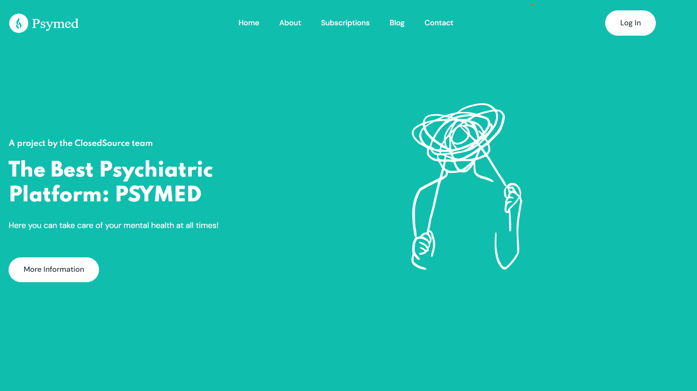

**Sección de Aplicación**: Se implementó la sección de la aplicación detallando el propósito de la misma.

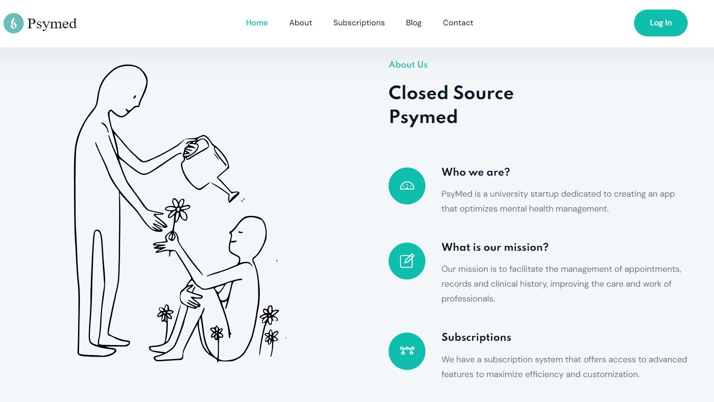

**Sección de Servicios**: Se implementó la sección de los servicios ofrecidos.

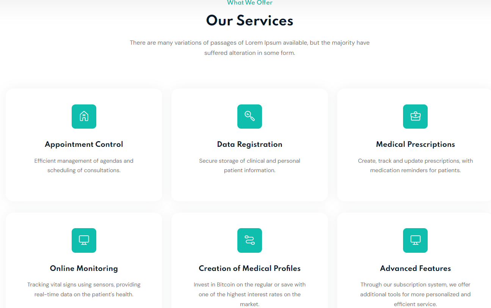

**Sección de Planes**: Se implementó la sección de ver los tipos de suscripción.

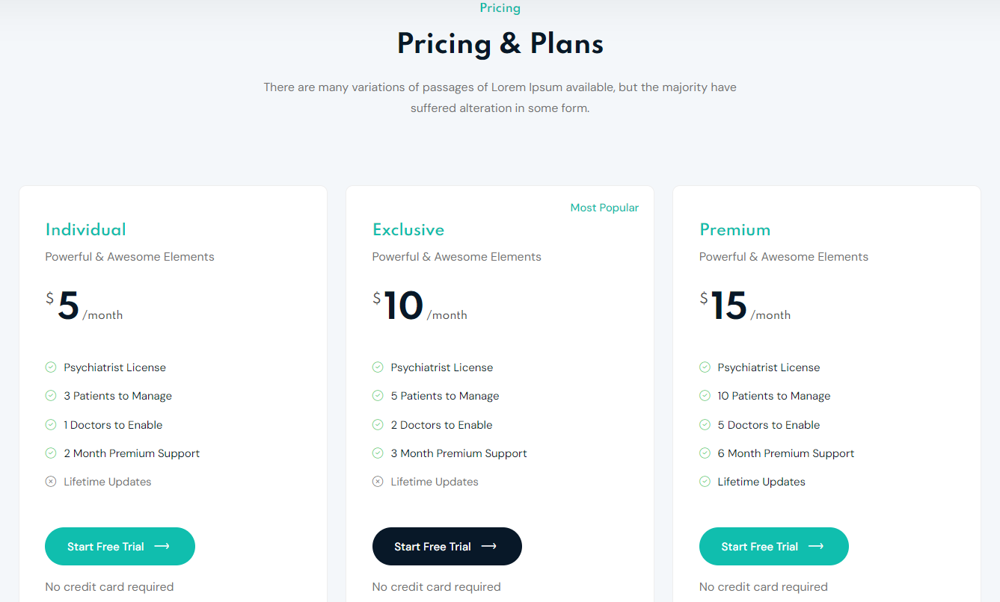

**Sección de Creadores**: Se añadió la sección de información sobre los desarrolladores de la plataforma.

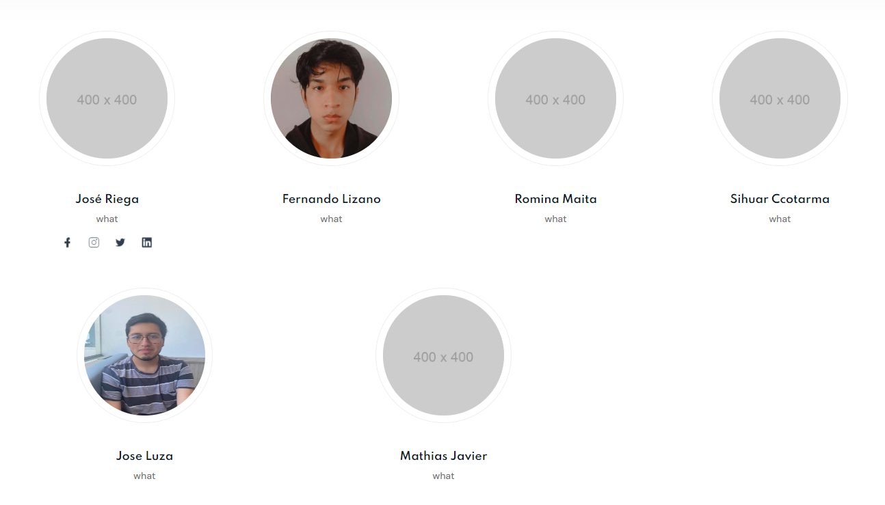

**Sección de About the Team**: Se implementó la sección del About the Team

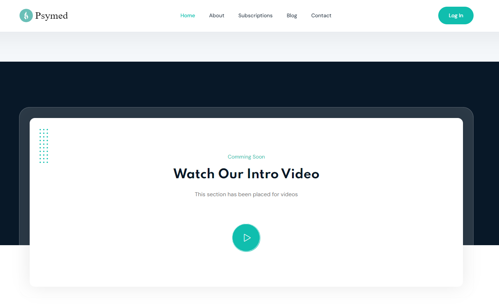

### 5.2.1.6. Services Documentation Evidence for Sprint Review

En el presente sprint solo se desarrolló la Landing Page.

### 5.2.1.7. Software Deployment Evidence for Sprint Review

Para el despliegue de la Landing Page, utilizamos la herramienta GitHub Pages para realizar el deployment. Creamos un repositorio en el cual almacenamos el código de nuestra Landing Page.

Después de crear el repositorio, accedemos a la configuración y seleccionamos la sección de Pages. Allí, ingresamos los datos requeridos, como la fuente del branch que se utilizará para el deployment. Finalmente, GitHub Pages nos proporciona un enlace y publica nuestra Landing Page en la web.

### 5.2.1.8. Team Collaboration Insights during Sprint.

### 5.2.2. Sprint 2

### 5.2.2.1. Sprint Planning 2
En este sprint, nos enfocaremos en corregir los errores detectados en el sprint anterior y nos dedicaremos a la implementación del frontend para los bounded contexts identificados en el proyecto.

<table>
  <thead>
    <tr>
      <td colspan="2">Sprint 2</td>
    </tr>
  </thead>
  <tbody>
    <tr>
      <td colspan="2"><strong>Sprint Planning Background</strong></td>
    </tr>
    <tr>
      <td><strong>Date</strong></td>
      <td>28/07/24</td>
    </tr>
    <tr>
      <td><strong>Time</strong></td>
      <td>8:00 PM</td>
    </tr>
    <tr>
      <td><strong>Location</strong></td>
      <td>Via Discord</td>
    </tr>
    <tr>
      <td><strong>Prepared By</strong></td>
      <td>Romina Maita</td>
    </tr>
    <tr>
      <td><strong>Attendees (to planning meeting)</strong></td>
      <td>Fernando Lizano, Romina Maita, Sihuar Ccotarma, Jose Riega, Jose Luza y Mathias Javier</td>
    </tr>
    <tr>
      <td><strong>Sprint 2 Review Summary</strong></td>
      <td>En esta primera sección se presentó el avance del frontend de la aplicación y sus respectivos bounded contexts.</td>
    </tr>
    <tr>
      <td><strong>Sprint 2 Retrospective Summary</strong></td>
      <td>En esta reunión, todos los integrantes tuvieron aciertos en la creación y la implementación del código. Además, todos colaboraron en el diseño y la implementación del frontend, contribuyendo a un desarrollo más ágil y efectivo del proyecto.</td>
    </tr>
    <tr>
      <td colspan="2"><strong>Sprint Goal & User Stories</strong></td>
    </tr>
    <tr>
      <td><strong>Sprint 2 Goal</strong></td>
      <td>Implementar los Bounded Contexts y diseñar cada uno de ellos.</td>
    </tr>
    <tr>
      <td><strong>Sprint 2 Velocity</strong></td>
      <td>2 story points</td>
    </tr>
    <tr>
      <td><strong>Sum of Story Points</strong></td>
      <td>11 Story Points</td>
    </tr>
  </tbody>
</table>

### 5.2.2.2. Sprint Backlog 2
<table>
<tr>
    <th colspan="3">Sprint #</th>
    <th colspan="10">Sprint 2</th>
  </tr>
      <tr>
    <td colspan="3">User Story</td>
    <td colspan="10">Work-Item/Task</td>
  </tr>
  <tr>
    <td colspan="1">Id</td>
    <td colspan="2">Title</td>
    <td colspan="1">Id</td>
    <td colspan="2">Title</td>
    <td colspan="3">Description</td>
    <td colspan="1"> Estimation</td>
    <td colspan="2">Assigned To</td>
    <td colspan="1">Status(To-do /InProcess /To-Review /Done)</td>
</tr>
  <tr>
    <td colspan="1">US14</td>
    <td colspan="2">Registro de medicamentos del paciente</td>
    <td colspan="1">1</td>
    <td colspan="2">Añadir función de registro de medicamentos</td>
    <td colspan="3">Como profesional de la salud mental, quiero registrar los medicamentos del paciente para seguir adecuadamente su tratamiento farmacológico.</td>
    <td colspan="1">2</td>
    <td colspan="2">Romina</td>
    <td colspan="1">Done</td>
  </tr>
  <tr>
    <td colspan="1">US19</td>
    <td colspan="2">Visualización de los estados de ánimo del paciente</td>
    <td colspan="1">2</td>
    <td colspan="2">Añadir función de visualización de estados de ánimo</td>
    <td colspan="3">Como profesional de la salud mental, quiero visualizar un registro de los estados de ánimo históricos del paciente para evaluar su progreso emocional.</td>
    <td colspan="1">3</td>
    <td colspan="2">Jose Luza</td>
    <td colspan="1">Done</td>
  </tr>
  <tr>
    <td colspan="1">US20</td>
    <td colspan="2">Visualizar información del consumo de medicamentos</td>
    <td colspan="1">3</td>
    <td colspan="2">Añadir función de visualización de consumo de medicamentos</td>
    <td colspan="3">Como profesional de la salud mental, quiero visualizar registros del cumplimiento del paciente con el consumo de la medicación asignada.</td>
    <td colspan="1">2</td>
    <td colspan="2">Romina</td>
    <td colspan="1">Done</td>
  </tr>
  <tr>
    <td colspan="1">US33</td>
    <td colspan="2">Registro de estado de ánimo</td>
    <td colspan="1">4</td>
    <td colspan="2">Añadir función de registro de estado de ánimo</td>
    <td colspan="3">Como paciente, quiero comunicarle a mi profesional mi estado de ánimo para ver el progreso de mi tratamiento.</td>
    <td colspan="1">2</td>
    <td colspan="2">Jose Luza</td>
    <td colspan="1">Done</td>
</tr>
</table>

### 5.2.2.3. Development Evidence for Sprint Review
<table>
    <tr>
        <th colspan="2">Repository</th>
        <th colspan="2">Branch</th>
        <th colspan="2">Commit Id</th>
        <th colspan="2">Commit Message</th>
        <th colspan="2">Commit Message Body</th>
        <th colspan="2">Commited on (Date)</th>
    </tr>
        <tr>
        <td colspan="2">Aplicaciones-Webs-Grupo04/Frontend-Web</td>
        <td colspan="2">master</td>
        <td colspan="2">a3c2552</td>
        <td colspan="2">initial commit</td>
        <td colspan="2">-</td>
        <td colspan="2">27/09/2024</td>
    </tr>
        <tr>
        <td colspan="2">Aplicaciones-Webs-Grupo04/Frontend-Web</td>
        <td colspan="2">master</td>
        <td colspan="2">a3b0753</td>
        <td colspan="2">feat: added db.json.</td>
        <td colspan="2">-</td>
        <td colspan="2">27/09/2024</td>
    </tr>
     <tr>
        <td colspan="2">Aplicaciones-Webs-Grupo04/Frontend-Web</td>
        <td colspan="2">usermng</td>
        <td colspan="2">b6be4b4</td>
        <td colspan="2">feat: add user-mng.component.vue component into src\BC_user-management\pages</td>
        <td colspan="2">-</td>
        <td colspan="2">27/09/2024</td>
    </tr>
    <tr>
        <td colspan="2">Aplicaciones-Webs-Grupo04/Frontend-Web</td>
        <td colspan="2">tasks</td>
        <td colspan="2">bc26cba</td>
        <td colspan="2">feat: add content for task.management.component.vue</td>
        <td colspan="2">-</td>
        <td colspan="2">27/09/2024</td>
    </tr>
    <tr>
        <td colspan="2">Aplicaciones-Webs-Grupo04/Frontend-Web</td>
        <td colspan="2">entrys</td>
        <td colspan="2">1a9235f</td>
        <td colspan="2">feat: add Patient-Entrys</td>
        <td colspan="2">-</td>
        <td colspan="2">27/09/2024</td>
    </tr>
    <tr>
        <td colspan="2">Aplicaciones-Webs-Grupo04/Frontend-Web</td>
        <td colspan="2">home</td>
        <td colspan="2">e0f3333</td>
        <td colspan="2">feat: add home content</td>
        <td colspan="2">-</td>
        <td colspan="2">27/09/2024</td>
    </tr>
    <tr>
        <td colspan="2">Aplicaciones-Webs-Grupo04/Frontend-Web</td>
        <td colspan="2">master</td>
        <td colspan="2">fc5ca74</td>
        <td colspan="2">feat: deploy json server</td>
        <td colspan="2">-</td>
        <td colspan="2">27/09/2024</td>
    </tr>
    <tr>
        <td colspan="2">Aplicaciones-Webs-Grupo04/Frontend-Web</td>
        <td colspan="2">medications</td>
        <td colspan="2">23e076d</td>
        <td colspan="2">feat: added medication entity variables</td>
        <td colspan="2">-</td>
        <td colspan="2">27/09/2024</td>
    </tr>
    <tr>
        <td colspan="2">Aplicaciones-Webs-Grupo04/Frontend-Web</td>
        <td colspan="2">develop</td>
        <td colspan="2">31e81a8</td>
        <td colspan="2">add: add router</td>
        <td colspan="2">-</td>
        <td colspan="2">27/09/2024</td>
    </tr>
</table>

### 5.2.2.4. Testing Suite Evidence for Sprint Review
Se realizaron pruebas unitarias para el "db.json". A continuación, se muestran imágenes de estas pruebas unitarias.

A través del siguiente comando, se ejecuta el servidor json.

    json-server --watch server/db.json

  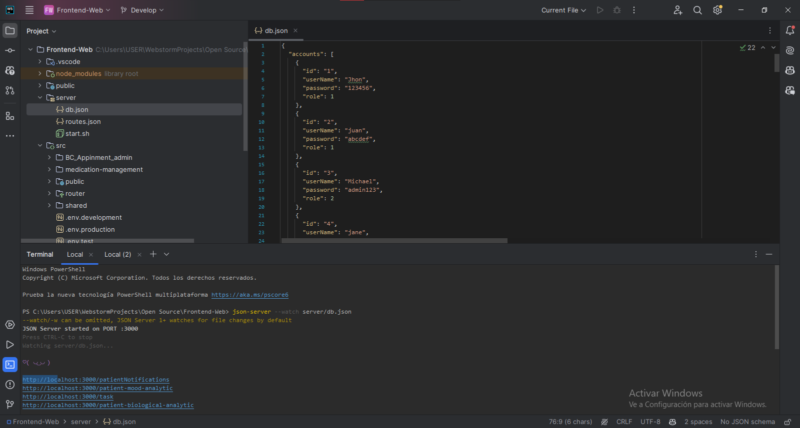

Luego, podemos observar que este ha sido alojado en la dirección:

    http://localhost:3000/

  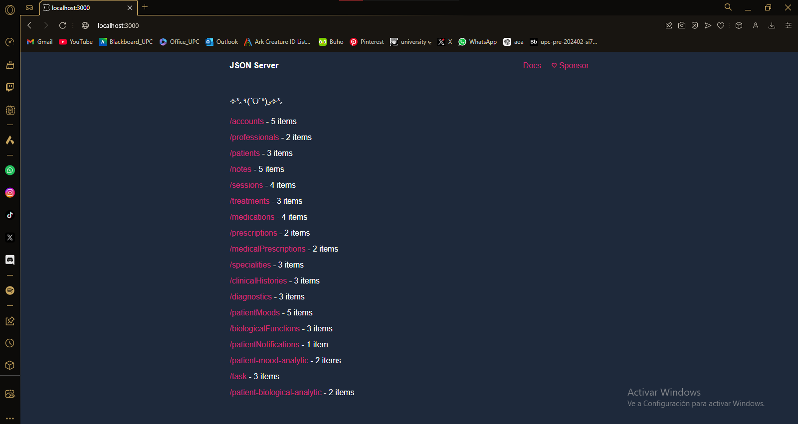

---

Para el uso de la plataforma vía el siguiente comando:

    npm run dev

  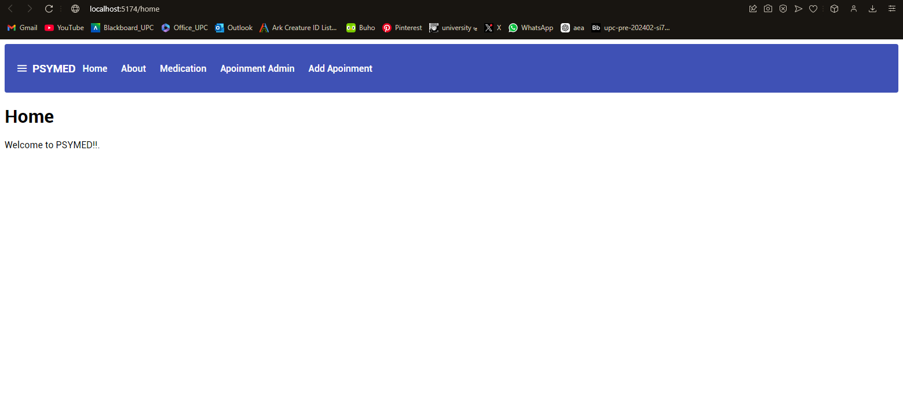

### 5.2.1.5. Execution Evidence for Sprint Review
- **Gestión de Usuarios:** Permite administrar las cuentas de los usuarios, sus permisos y accesos.
- **Gestión de Notas de Sección:** Facilita el registro y seguimiento de notas clínicas importantes por cada sesión o visita.
- **Gestión de Administración de Citas:** Optimiza la organización de citas, recordatorios y disponibilidad del personal médico.
- **Gestión de Dashboards de Analytics:** Proporciona visualizaciones y análisis de datos relevantes para la toma de decisiones.
- **Gestión de Seguimiento de Síntomas y Estado:** Permite monitorear y registrar los síntomas y la evolución del estado de los pacientes.
- **Gestión de Medicación:** Administra las prescripciones médicas, recordatorios de dosis y actualizaciones de medicación.

### 5.2.1.6. Services Documentation Evidence for Sprint Review
Este servicio base facilita las operaciones CRUD utilizando la API vercel.app. Inicialmente, se utilizó json-server para pruebas locales, migrando luego a Beeceptor y finalmente a la API desplegada. Este enfoque validó el frontend sin necesidad de un backend completo, asegurando una integración eficiente y consistente.

Se puede acceder a la API desplegada, pulsando sobre la siguiente imagen.

  

<table>
  <thead>
    <tr>
      <th>Elemento</th>
      <th>Descripción</th>
    </tr>
  </thead>
  <tbody>
    <tr>
      <td><strong>Archivo</strong></td>
      <td>http-common.js</td>
    </tr>
    <tr>
      <td><strong>Propósito</strong></td>
      <td>Configurar una instancia de axios para realizar operaciones CRUD (Crear, Leer, Actualizar, Eliminar) en recursos a través de una API en una aplicación Vue.</td>
    </tr>
    <tr>
      <td><strong>Dependencias</strong></td>
      <td>
        <code>axios</code> para manejar solicitudes HTTP en Vue.  
        <code>API_BASE_URL</code> configurado mediante <code>import.meta.env.VITE_API_BASE_URL</code>.
      </td>
    </tr>
    <tr>
      <td><strong>Propiedades</strong></td>
      <td>
        <ul>
          <li><code>http</code>: Instancia de <code>axios</code> para realizar solicitudes HTTP, configurada con <code>API_BASE_URL</code>.</li>
        </ul>
      </td>
    </tr>
    <tr>
      <td><strong>Métodos</strong></td>
      <td>
        <ul>
          <li><code>obtenerSessions(): Promise&lt;T[]&gt;</code>: Recupera todas las sesiones desde el endpoint <code>/sessions</code>.</li>
          <li><code>agregarSesion(sesion: any): Promise&lt;T&gt;</code>: Agrega una nueva sesión enviando un objeto <code>sesion</code> a la API.</li>
          <li><code>handleError(error: any): void</code>: Maneja errores en las solicitudes HTTP e imprime información del error en la consola de Vue.</li>
        </ul>
      </td>
    </tr>
  </tbody>
</table>

### 5.2.1.7. Software Deployment Evidence for Sprint Review
**Evidencias del deploy:**

Primero usamos los comandos correspondientes:

    npm run build
    npm install -g firebase-tools
    firebase login
    firebase init
    firebase deploy

Evidencia:

  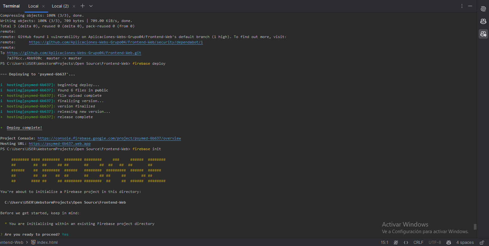

Evidencias deL link:

  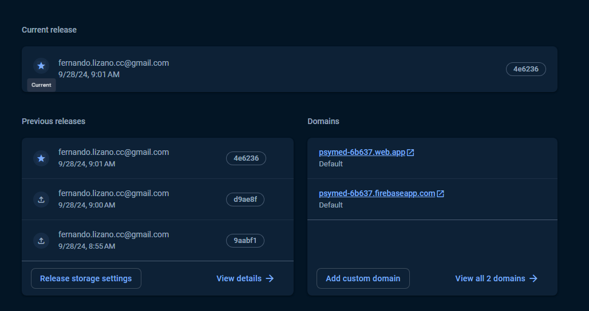

Evidencias del deploy:

  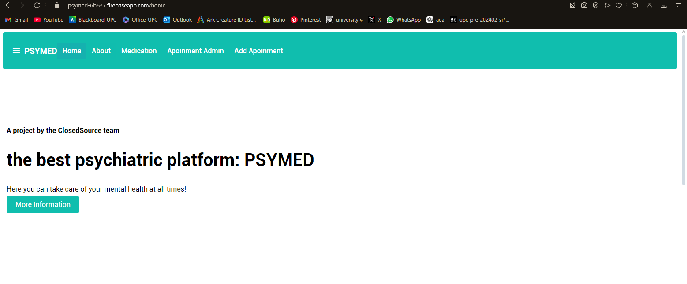

### 5.2.1.8. Team Collaboration Insights during Sprint
Para el desarrollo de este sprint, todos los miembros del equipo desarrollaron y colaboraron de manera activa y continua. De tal modo, se muestra como evidencia los insights de cada miembro del equipo. 

**Commits:**

  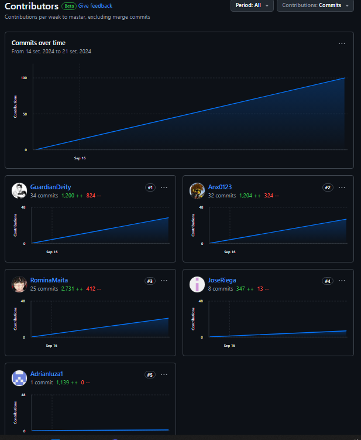

### 5.2.3. Sprint 3
### 5.2.3.1.Spring Planning 3.
En este sprint, nos enfocaremos en corregir los errores
detectados en el sprint anterior y nos dedicaremos a la
implementación del Backend para los bounded contexts
identificados en el proyecto.

<table>
<tr>
    <th colspan="5">Sprint 3</th>
    <th colspan="9">Sprint 3</th>
  </tr>
      <tr>
    <td colspan="13">Sprint Planning Background</td>
  </tr>
  <tr>
    <td colspan="5">Date</td>
    <td colspan="8"> 8/10/24  </td>
</tr>
  <tr>
    <td colspan="5">Time</td>
    <td colspan="8"> 9:00 PM </td>
  </tr>
  <tr>
    <td colspan="5">Location</td>
    <td colspan="8">Via Discord</td>
<tr>
    <td colspan="5">Prepared By</td>
    <td colspan="8">Fernando</td>
</tr>
<tr>
    <td colspan="5">Attendees (to planning meeting)</td>
    <td colspan="8">Fernando,Romina,Sihuar,Jose, Mathias,Jose Miguel</td>
</tr>
<tr>
    <td colspan="5">Sprint 3 Review Summary</td>
    <td colspan="8">
En esta primera sección se presentó el progreso continuo del frontend de la aplicación y sus respectivos bounded contexts. Ademas de la primera version del Backend
</td>
</tr>
<tr>
    <td colspan="5">Sprint 3 Retrospective Summary</td>
    <td colspan="8">
En esta reunión, todos los integrantes tuvieron aciertos 
en la creación y la implementación del código. Además, 
todos colaboraron en el diseño y la implementación del 
frontend y Backend, contribuyendo a un desarrollo más ágil y
efectivo, Aplicando convenciones de Domain Driven Design
del proyecto.</td>
</tr>
<tr>
    <td colspan="13">Sprint Goal & User Stories</td>
</tr>
<tr>
    <td colspan="5">Sprint 3 Goal</td>
    <td colspan="8">
El objetivo de este sprint fue implementar el Backend de la web API, enfocándose en los bounded contexts para estructurar la aplicación de manera modular. Se desarrollaron servicios, se integraron con la base de datos y se documentó la API, asegurando la escalabilidad y facilidad de mantenimiento en el tiempo asignado.
</td>
</tr>
<tr>
    <td colspan="5">Sprint 3 Velocity</td>
    <td colspan="8">  story points</td>
</tr>
<tr>
    <td colspan="5">Sum of Story Points</td>
    <td colspan="8">  Story Points</td>
</tr>
</table>

### 5.2.3.2.Sprint Backlog 3.

<table border="1">
  <tr>
    <th colspan="3">Sprint 3</th>
    <th colspan="10">Sprint 3</th>
  </tr>
  <tr>
    <td colspan="3">User Story</td>
    <td colspan="10">Work-Item/Task</td>
  </tr>
  <tr>
    <td colspan="1">ID</td>
    <td colspan="2">Title</td>
    <td colspan="1">ID</td>
    <td colspan="2">Title</td>
    <td colspan="3">Description</td>
    <td colspan="1">Estimation</td>
    <td colspan="2">Assigned to</td>
    <td colspan="1">Status (To-do / InProcess / To-Review / Done)</td>
  </tr>
  <tr>
    <td colspan="1">TS24</td>
    <td colspan="2">Registro de sesión terapéutica a través de un RESTful API</td>
    <td colspan="1">UT01</td>
    <td colspan="2">Desarrollo de capa de aplicación</td>
    <td colspan="3">Crear el servicio de "Registrar Sesión Terapéutica" que procese la información y valide los datos requeridos.</td>
    <td colspan="1">3h</td>
    <td colspan="2">Sihuar s</td>
    <td colspan="1">Done</td>
  </tr>
  <tr>
    <td colspan="1"></td>
    <td colspan="2"></td>
    <td colspan="1">UT02</td>
    <td colspan="2">Desarrollo de capa de dominio</td>
    <td colspan="3">Implementar modelos y servicios para registrar una sesión terapéutica, asegurando la integración con entidades de paciente y profesional.</td>
    <td colspan="1">3h</td>
    <td colspan="2">Sihuar </td>
    <td colspan="1">Done</td>
  </tr>

  <tr>
    <td colspan="1">TS25</td>
    <td colspan="2">Obtener sesión terapéutica a través de un RESTful API</td>
    <td colspan="1">UT05</td>
    <td colspan="2">Desarrollo de capa de aplicación</td>
    <td colspan="3">Crear el servicio de "Obtener Sesión Terapéutica" que procese la solicitud y recupere los detalles de la sesión según el ID proporcionado.</td>
    <td colspan="1">3h</td>
    <td colspan="2"> Mathyas</td>
    <td colspan="1">Done</td>
  </tr>
  <tr>
    <td colspan="1"></td>
    <td colspan="2"></td>
    <td colspan="1">UT06</td>
    <td colspan="2">Desarrollo de capa de dominio</td>
    <td colspan="3">Implementar modelos y servicios para recuperar la información de una sesión terapéutica, validando la existencia de la sesión y su relación con el paciente.</td>
    <td colspan="1">3h</td>
    <td colspan="2"> Mathyas</td>
    <td colspan="1">Done</td>
  </tr>
 
  <tr>
    <td colspan="1">US12</td>
    <td colspan="2">Ingresar estados de animo</td>
    <td colspan="1">UT09</td>
    <td colspan="2">lista de estados emocionales del paciente</td>
    <td colspan="3">Crear una page donde el profesional pueda ver los estados de ánimo históricos del paciente seleccionado</td>
    <td colspan="1">2h</td>
    <td colspan="2">Jose</td>
    <td colspan="1">Done</td>
  </tr>

  <tr>
    <td colspan="1">US14</td>
    <td colspan="2">Regitrar medicacion del paciente</td>
    <td colspan="1">UT13</td>
    <td colspan="2">Edicion de medicación</td>
    <td colspan="3">Crear un botón que permita editar los datos una medicación</td>
    <td colspan="1">1h</td>
    <td colspan="2">Jose</td>
    <td colspan="1">Done</td>
  </tr>
 
  <tr>
    <td colspan="1">US15</td>
    <td colspan="2">Registrar notas por sesion</td>
    <td colspan="1">UT15</td>
    <td colspan="2">Card de notas de sesion</td>
    <td colspan="3">Crear una card que contenga los elementos de la entidad “Session Notes”</td>
    <td colspan="1">1h</td>
    <td colspan="2">Jose</td>
    <td colspan="1">Done</td>
  </tr>
  <tr>
    <td colspan="1">US15</td>
    <td colspan="2">Registrar notas por sesion</td>
    <td colspan="1">UT16</td>
    <td colspan="2">Formulario de creacion de notas por sesion</td>
    <td colspan="3">Desarrollar un formulario de creacion de notas por sesion</td>
    <td colspan="1">1h</td>
    <td colspan="2">Jose</td>
    <td colspan="1">Done</td>
  </tr>

  <tr>
    <td colspan="1">US16</td>
    <td colspan="2">Editar notas por sesion</td>
    <td colspan="1">UT18</td>
    <td colspan="2">Formulario de edicion de notas</td>
    <td colspan="3">Crear un formulario de edicion de notas</td>
    <td colspan="1">2h</td>
    <td colspan="2">Jose</td>
    <td colspan="1">Done</td>
  </tr>
  <tr>
    <td colspan="1">US17</td>
    <td colspan="2">Actualizar diagnostico del paciente</td>
    <td colspan="1">UT20</td>
    <td colspan="2">Formulario de edición del diagnostico de paciente</td>
    <td colspan="3">Crear un formulario de edicion para los diagnósticos del paciente</td>
    <td colspan="1"></td>
    <td colspan="2">Jose</td>
    <td colspan="1">Done</td>
  </tr>
  <tr>
    <td colspan="1">TS11</td>
    <td colspan="2">Actualizar información de consumo de pastillas del paciente a través de un RESTful API</td>
    <td colspan="1">UT22</td>
    <td colspan="2">Desarrollo de capa de aplicación</td>
    <td colspan="3">Crear el servicio de "Actualizar Consumo de Pastillas".</td>
    <td colspan="1">3h</td>
    <td colspan="2">Romina</td>
    <td colspan="1">To Do</td>
  </tr>
  <tr>
    <td colspan="1"></td>
    <td colspan="2"></td>
    <td colspan="1">UT23</td>
    <td colspan="2">Desarrollo de capa de dominio</td>
    <td colspan="3">Implementar modelos y servicios para actualizar información de consumo de pastillas.</td>
    <td colspan="1">3h</td>
    <td colspan="2">Romina</td>
    <td colspan="1">To Do</td>
  </tr>
  <tr>
    <td colspan="1"></td>
    <td colspan="2"></td>
    <td colspan="1">UT24</td>
    <td colspan="2">Desarrollo de capa de infraestructura</td>
    <td colspan="3">Crear el endpoint PUT</td>
    <td colspan="1">4h</td>
    <td colspan="2">Romina</td>
    <td colspan="1">To Do</td>
  </tr>
  <tr>
    <td colspan="1"></td>
    <td colspan="2"></td>
    <td colspan="1">UT25</td>
    <td colspan="2">Desarrollo de capa de interfaces</td>
    <td colspan="3">Crear controladores</td>
    <td colspan="1">4h</td>
    <td colspan="2">Romina</td>
    <td colspan="1">To Do</td>
  </tr>
  <tr>
    <td colspan="1">TS07</td>
    <td colspan="2">Añadir medicamentos de un paciente a través de un RESTful API</td>
    <td colspan="1">UT26</td>
    <td colspan="2">Desarrollo de capa de aplicación</td>
    <td colspan="3">Crear el servicio de "Añadir Medicamento a Paciente".</td>
    <td colspan="1">3h</td>
    <td colspan="2">Romina</td>
    <td colspan="1">Done</td>
  </tr>
  <tr>
    <td colspan="1"></td>
    <td colspan="2"></td>
    <td colspan="1">UT27</td>
    <td colspan="2">Desarrollo de capa de dominio</td>
    <td colspan="3">Implementar modelos y servicios para añadir medicamentos.</td>
    <td colspan="1">3h</td>
    <td colspan="2">Romina</td>
    <td colspan="1">Done</td>
  </tr>
  <tr>
    <td colspan="1"></td>
    <td colspan="2"></td>
    <td colspan="1">UT28</td>
    <td colspan="2">Desarrollo de capa de infraestructura</td>
    <td colspan="3">Crear el endpoint POST</td>
    <td colspan="1">4h</td>
    <td colspan="2">Romina</td>
    <td colspan="1">Done</td>
  </tr>
 
  <tr>
    <td colspan="1">TS10</td>
    <td colspan="2">Recuperar datos de consumo de medicamentos válidos</td>
    <td colspan="1">UT30</td>
    <td colspan="2">Desarrollo de capa de aplicación</td>
    <td colspan="3">Crear el servicio de "Recuperar Datos de Consumo Válido".</td>
    <td colspan="1">3h</td>
    <td colspan="2">Romina</td>
    <td colspan="1">To Do</td>
  </tr>
 
  <tr>
    <td colspan="1"></td>
    <td colspan="2"></td>
    <td colspan="1">UT32</td>
    <td colspan="2">Desarrollo de capa de infraestructura</td>
    <td colspan="3">Crear el endpoint GET</td>
    <td colspan="1">4h</td>
    <td colspan="2">Romina</td>
    <td colspan="1">To DO</td>
  </tr>
 
<tr>
    <td colspan="1">TS20</td>
    <td colspan="2">Registro de confirmación de consumo de pastillas a través de un RESTful API</td>
    <td colspan="1">UT20</td>
    <td colspan="2">Desarrollo de capa de aplicación</td>
    <td colspan="3">Crear el servicio de "Confirmación de Consumo de Pastillas".</td>
    <td colspan="1">3h</td>
    <td colspan="2">Romina</td>
    <td colspan="1">Done</td>
</tr>
<tr>
    <td colspan="1"></td>
    <td colspan="2"></td>
    <td colspan="1">UT21</td>
    <td colspan="2">Desarrollo de capa de dominio</td>
    <td colspan="3">Implementar modelos y servicios para recuperar datos de consumo de medicamentos válidos</td>
    <td colspan="1">3h</td>
    <td colspan="2">Romina</td>
    <td colspan="1">Done</td>
</tr>
<tr>
    <td colspan="1"></td>
    <td colspan="2"></td>
    <td colspan="1">UT22</td>
    <td colspan="2">Desarrollo de capa de infraestructura</td>
    <td colspan="3">Crear el endpoint POST</td>
    <td colspan="1">4h</td>
    <td colspan="2">Romina</td>
    <td colspan="1">Done</td>
</tr>

<tr>
    <td colspan="1">TS05</td>
    <td colspan="2">Inicio de sesión a través de un RESTful API</td>
    <td colspan="1">UT24</td>
    <td colspan="2">Comandos y servicios para sign in</td>
    <td colspan="3">Desarrollo de comandos y servicios para sign in</td>
    <td colspan="1">1h</td>
    <td colspan="2">Fernando</td>
    <td colspan="1">Done</td>
</tr>

<tr>
    <td colspan="1">TS01</td>
    <td colspan="2">Añadir paciente a través de un RESTful API</td>
    <td colspan="1">UT26</td>
    <td colspan="2">Capa de dominio e infraestructura del paciente</td>
    <td colspan="3">Desarrollo de la capa de dominio e infraestructura para el perfil del paciente</td>
    <td colspan="1">2h</td>
    <td colspan="2">Fernando</td>
    <td colspan="1">Done</td>
</tr>

<tr>
    <td colspan="1">TS02</td>
    <td colspan="2">Añadir profesional de la salud mental a través de un RESTful API</td>
    <td colspan="1">UT30</td>
    <td colspan="2">Capa de dominio e infraestructura del profesional</td>
    <td colspan="3">Desarrollo de la capa de dominio e infraestructura para el perfil del profesional</td>
    <td colspan="1">2h</td>
    <td colspan="2">Fernando</td>
    <td colspan="1">Done</td>
</tr>
<tr>
    <td colspan="1"></td>
    <td colspan="2"></td>
    <td colspan="1">UT31</td>
    <td colspan="2">Capa de aplicación e interfaz</td>
    <td colspan="3">Desarrollo de la capa de aplicación e interfaz para el perfil del profesional</td>
    <td colspan="1">2h</td>
    <td colspan="2">Fernando</td>
    <td colspan="1">Done</td>
</tr>

<tr>
    <td colspan="1">TS21</td>
    <td colspan="2">Registro de funciones biológicas a través de un RESTful API</td>
    <td colspan="1">UT34</td>
    <td colspan="2">Capa de dominio e infraestructura del registro de funciones biológicas</td>
    <td colspan="3">Desarrollo de la capa de dominio e infraestructura para el registro de funciones biológicas</td>
    <td colspan="1">2h</td>
    <td colspan="2">Fernando</td>
    <td colspan="1">Done</td>
</tr>
<tr>
    <td colspan="1">TS19</td>
    <td colspan="2">Registro de estado de ánimo del paciente a través de un RESTful API</td>
    <td colspan="1">UT38</td>
    <td colspan="2">Capa de dominio e infraestructura del registro de estado de ánimo</td>
    <td colspan="3">Agregar el registro de estado de ánimo a la capa de dominio e infraestructura para el registro de funciones biológicas</td>
    <td colspan="1">2h</td>
    <td colspan="2">Fernando</td>
    <td colspan="1">Done</td>
</tr>
<tr>
    <td colspan="1"></td>
    <td colspan="2"></td>
    <td colspan="1">UT39</td>
    <td colspan="2">Capa de aplicación e interfaz</td>
    <td colspan="3">Agregar el registro de estados de ánimo del paciente a la capa de aplicación e interfaz para el perfil del profesional</td>
    <td colspan="1">2h</td>
    <td colspan="2">Fernando</td>
    <td colspan="1">Done</td>
</tr>
  </table>

### 5.2.3.3.Development Evidence for Sprint Review.

En esta sección se explica y presenta los avances en implementación con relación a los productos de la solución según el alcance del Sprint 3 referente a los Web Services. Aquí se dejará alguno de los commits ya implementados dentro del repositorio de Github, junto a toda la información referente y a los cambios concluidos.

<table>
    <tr>
        <th colspan="2">Repository</th>
        <th colspan="2">Branch</th>
        <th colspan="2">Commit Id</th>
        <th colspan="2">Commit Message</th>
        <th colspan="2">Commit Message Body</th>
        <th colspan="2">Committed on (Date)</th>
    </tr>
    <tr>
        <td colspan="2">Aplicaciones-Webs-Grupo04/Backend-Web</td>
        <td colspan="2">develop</td>
        <td colspan="2">f2ce51c</td>
        <td colspan="2">chore: add model builder extensions and string extensions</td>
        <td colspan="2">-</td>
        <td colspan="2">01/11/2024</td>
    </tr>
    <tr>
        <td colspan="2">Aplicaciones-Webs-Grupo04/Backend-Web</td>
        <td colspan="2">develop</td>
        <td colspan="2">c2e517f</td>
        <td colspan="2">chore: add kebabcase naming convention</td>
        <td colspan="2">-</td>
        <td colspan="2">01/11/2024</td>
    </tr>
    <tr>
        <td colspan="2">Aplicaciones-Webs-Grupo04/Backend-Web</td>
        <td colspan="2">develop</td>
        <td colspan="2">1b569ac</td>
        <td colspan="2">chore: add kebabcase naming convention</td>
        <td colspan="2">-</td>
        <td colspan="2">01/11/2024</td>
    </tr>
    <tr>
        <td colspan="2">Aplicaciones-Webs-Grupo04/Backend-Web</td>
        <td colspan="2">develop</td>
        <td colspan="2">d971c01</td>
        <td colspan="2">chore: add extensions</td>
        <td colspan="2">-</td>
        <td colspan="2">01/11/2024</td>
    </tr>
    <tr>
        <td colspan="2">Aplicaciones-Webs-Grupo04/Backend-Web</td>
        <td colspan="2">develop</td>
        <td colspan="2">d5cdca2</td>
        <td colspan="2">chore: added repositories to shared file</td>
        <td colspan="2">-</td>
        <td colspan="2">01/11/2024</td>
    </tr>
    <tr>
        <td colspan="2">Aplicaciones-Webs-Grupo04/Backend-Web</td>
        <td colspan="2">develop</td>
        <td colspan="2">3e373f2</td>
        <td colspan="2">feat: create task repository</td>
        <td colspan="2">-</td>
        <td colspan="2">01/11/2024</td>
    </tr>
    <tr>
        <td colspan="2">Aplicaciones-Webs-Grupo04/Backend-Web</td>
        <td colspan="2">develop</td>
        <td colspan="2">a7936c2</td>
        <td colspan="2">feat: create task query service</td>
        <td colspan="2">-</td>
        <td colspan="2">01/11/2024</td>
    </tr>
    <tr>
        <td colspan="2">Aplicaciones-Webs-Grupo04/Backend-Web</td>
        <td colspan="2">develop</td>
        <td colspan="2">db9bb85</td>
        <td colspan="2">feat: create task query</td>
        <td colspan="2">-</td>
        <td colspan="2">01/11/2024</td>
    </tr>
    <tr>
        <td colspan="2">Aplicaciones-Webs-Grupo04/Backend-Web</td>
        <td colspan="2">develop</td>
        <td colspan="2">aa7b7f1</td>
        <td colspan="2">feat: create command service for task</td>
        <td colspan="2">-</td>
        <td colspan="2">01/11/2024</td>
    </tr>
    <tr>
        <td colspan="2">Aplicaciones-Webs-Grupo04/Backend-Web</td>
        <td colspan="2">develop</td>
        <td colspan="2">b6f1811</td>
        <td colspan="2">feat: create task.cs</td>
        <td colspan="2">-</td>
        <td colspan="2">01/11/2024</td>
    </tr>
    <tr>
        <td colspan="2">Aplicaciones-Webs-Grupo04/Backend-Web</td>
        <td colspan="2">develop</td>
        <td colspan="2">d760e97</td>
        <td colspan="2">feat: aggregate tasks</td>
        <td colspan="2">-</td>
        <td colspan="2">01/11/2024</td>
    </tr>
</table>

### 5.2.3.4.Testing Suite Evidence for Sprint Review.

### 5.2.3.5.Execution Evidence for Sprint Review.
### 5.2.3.6.Services Documentation Evidence for Sprint Review.
### 5.2.3.7.Software Deployment Evidence for Sprint Review.
### 5.2.3.8.Team Collaboration Insights during Sprint.
## 5.3. Validation Interviews.
### 5.3.1. Diseño de Entrevistas.
Para validar la aplicación y recopilar feedback de los usuarios, se diseñaron entrevistas estructuradas para profesionales de la salud mental y pacientes. Estas entrevistas se centraron en aspectos clave de la aplicación, como la usabilidad, funcionalidades más utilizadas, dificultades encontradas, sugerencias de mejora y percepción de la seguridad de la información. A continuación, se presentan las preguntas diseñadas para cada grupo de usuarios:

* Preguntas para Profesionales de la Salud Mental

Preguntas Objetivas:
1. ¿Qué funcionalidades usas más en la aplicación? ¿Cuáles usas menos o te resultan innecesarias?
2. ¿Hay alguna funcionalidad que hayas intentado usar pero encontraste difícil o confusa?
3. ¿Te resulta fácil acceder y gestionar la información de tus pacientes desde la app? Si no, ¿qué aspecto mejorarías?
4. ¿Cuánto tiempo promedio te toma completar una consulta o registro dentro de la app? ¿Crees que puede reducirse?
5. ¿Consideras que el sistema de seguridad y privacidad de la app cumple con tus necesidades? ¿Qué mejorarías en este aspecto?

Preguntas Subjetivas:
1. ¿Qué añadirías o mejorarías en el sistema de seguimiento y gestión de pacientes?
2. ¿Qué tan intuitivo es el flujo de trabajo en la app? ¿Qué aspectos consideras que podrían simplificarse?
3. ¿Hay alguna funcionalidad adicional que creas importante para facilitar tu labor con los pacientes?
4. ¿Qué tan útil sería para ti un sistema de recordatorios o notificaciones automáticas? ¿Qué tipo de recordatorios preferirías recibir?
5. ¿Qué cambiarías en la interfaz de usuario para hacer la experiencia más agradable o eficiente?

* Preguntas para Pacientes

Preguntas Objetivas:
1. ¿Qué sección de la app usas más (ejemplo: citas, mensajes, notas de sesión)?
2. ¿Cuán fácil te resulta acceder a la información que necesitas, como horarios de citas o notas de las sesiones?
3. ¿Consideras que la aplicación facilita tus interacciones con el profesional? Si no, ¿qué mejorarías?
4. ¿Has experimentado dificultades técnicas al usar la app? Si es así, ¿cuáles?
5. ¿Sientes que tu información personal está segura en la aplicación? ¿Qué te haría sentir aún más seguro?

Preguntas Subjetivas:
1. ¿Qué funciones te gustaría agregar a la app para mejorar tu experiencia?
2. ¿Te gustaría recibir notificaciones para recordarte citas o tareas asignadas en sesión? ¿De qué tipo?
3. ¿Qué tan intuitiva y fácil de usar te parece la interfaz? ¿Qué parte cambiarías para mejorarla?
4. ¿Cómo te gustaría que evolucionara la app para mejorar la comunicación con tu profesional?
5. ¿Qué aspecto de la app consideras que más contribuye a tu comodidad o progreso en las sesiones? ¿Cómo podría potenciarse aún más?

### 5.3.2. Registro de Entrevistas.

  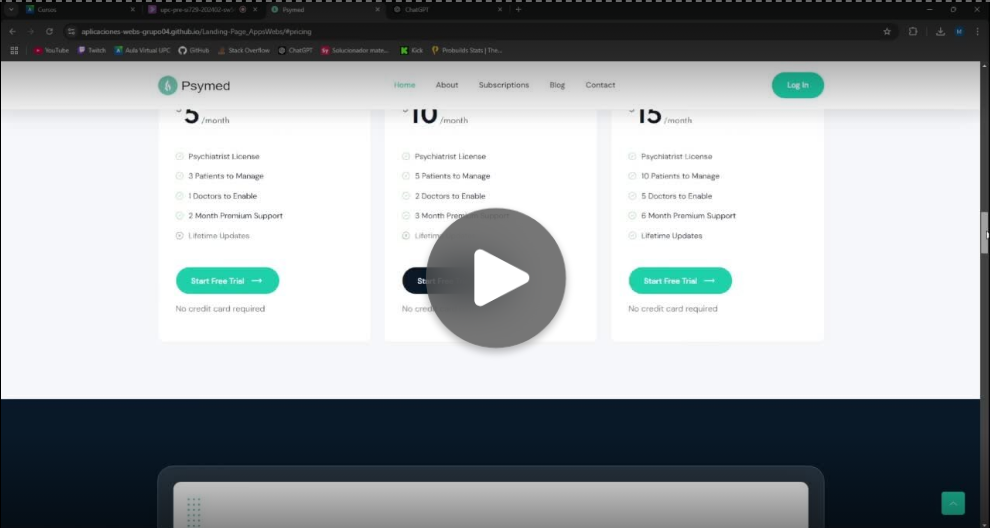

| Nombre               | Andrés Cieza de León                                                                                                                                                                                                                                                                                                                       |
|----------------------|----------------------------------------------------------------------------------------------------------------------------------------------------------------------------------------------------------------------------------------------------------------------------------------------------------------------------------------------|
| Edad                 | 27                                                                                                                                                                                                                                                                                                                                          |
| Distrito             | Miraflores                                                                                                                                                                                                                                                                                                                                  |
| URL                  | [Entrevistas](https://upcedupe-my.sharepoint.com/:v:/g/personal/u202022211_upc_edu_pe/EZO2orefyulCgGdPe9u4UR4BJFVk8tzp3JPXMGzpXtnhow?e=mGyGZu&nav=eyJyZWZlcnJhbEluZm8iOnsicmVmZXJyYWxBcHAiOiJTdHJlYW1XZWJBcHAiLCJyZWZlcnJhbFZpZXciOiJTaGFyZURpYWxvZy1MaW5rIiwicmVmZXJyYWxBcHBQbGF0Zm9ybSI6IldlYiIsInJlZmVycmFsTW9kZSI6InZpZXcifX0%3D) |
| Inicio de entrevista | 0:01 minutos                                                                                                                                                                                                                                                                                                                                |
| Fin de entrevista    | 03:32 minutos                                                                                                                                                                                                                                                                                                                               |

**Resumen:** Andrés Cieza de León, un profesional de 27 años, utiliza herramientas digitales para gestionar su trabajo. Utiliza principalmente la agenda de citas y las notas de pacientes dentro de la aplicación, aunque menciona que el sistema de estadísticas no es tan útil para su flujo de trabajo actual. Le resultó confuso configurar los recordatorios automáticos y sugiere una guía de ayuda en este aspecto.

Andrés considera que el acceso a la información de sus pacientes es adecuado, pero menciona que sería útil contar con una búsqueda avanzada que le permita filtrar por tipo de sesión o fecha. Por lo general, tarda de 5 a 10 minutos en completar una consulta en la app y sugiere la incorporación de plantillas predefinidas para acelerar el proceso en notas repetitivas. 

Respecto a la seguridad, Andrés está conforme con las medidas actuales, aunque opina que la inclusión de autenticación de dos factores incrementaría su confianza en la protección de los datos de sus pacientes.

A continuación, se resumen algunas ideas de mejora proporcionadas por Andrés:
- Incluir una guía de ayuda para configurar recordatorios automáticos.
- Mejorar la funcionalidad de búsqueda avanzada para filtrar información de los pacientes.
- Incorporar plantillas predefinidas para registrar consultas repetitivas rápidamente.
- Añadir autenticación de dos factores para reforzar la seguridad de la plataforma.

### 5.3.3. Evaluaciones según heurísticas.

Evaluación de la aplicación de salud mental utilizando las 10 heurísticas de usabilidad de Jakob Nielsen. Para cada heurística se incluyen observaciones específicas y sugerencias de mejora.

1. Visibilidad del estado del sistema
**Descripción:** La aplicación debe mantener al usuario informado sobre el estado de cada acción realizada.
   - **Observaciones:** La aplicación muestra un indicador de carga al guardar registros de pacientes, pero no siempre se muestra al agendar citas, lo cual puede generar confusión.
   - **Sugerencias de mejora:** Añadir indicadores de progreso en todos los procesos, especialmente al agendar y guardar información, para mejorar la visibilidad.

2. Concordancia entre el sistema y el mundo real
**Descripción:** Los términos y conceptos en la app deben ser familiares y fáciles de entender para el usuario.
   - **Observaciones:** Algunos términos médicos pueden ser difíciles de entender para pacientes que usan la app.
   - **Sugerencias de mejora:** Incluir un glosario de términos médicos o explicaciones contextuales para ayudar a los pacientes a comprender mejor la información.

3. Control y libertad del usuario
**Descripción:** Permitir que el usuario deshaga o rehaga acciones fácilmente.
    - **Observaciones:** No existe una opción para deshacer cambios en notas o registros, lo cual limita la flexibilidad en la gestión de datos.
    - **Sugerencias de mejora:** Incluir un botón de "Deshacer" o una opción de confirmar antes de guardar cambios importantes.

    
4. Consistencia y estándares
**Descripción:** Los usuarios deben reconocer fácilmente patrones y estilos consistentes en toda la aplicación.
   - **Observaciones:** Algunos botones de navegación están ubicados de forma inconsistente entre pantallas, lo cual puede confundir a los usuarios.
   - **Sugerencias de mejora:** Asegurarse de que todos los elementos de navegación tengan una ubicación y estilo consistentes.

5. Prevención de errores
**Descripción:** Diseñar la app para evitar errores del usuario, siempre que sea posible.
   - **Observaciones:** No hay alertas para prevenir la eliminación accidental de información importante.
   - **Sugerencias de mejora:** Implementar ventanas de confirmación para acciones críticas, como eliminar o modificar registros de pacientes.

6. Reconocimiento antes que recuerdo
**Descripción:** Minimizar la carga de memoria del usuario al mostrar opciones de manera visible y contextual.
   - **Observaciones:** Los usuarios deben navegar varios menús para acceder a información de citas y notas.
   - **Sugerencias de mejora:** Implementar un menú rápido o accesos directos a las secciones de uso frecuente.

7. Flexibilidad y eficiencia de uso
**Descripción:** La app debe permitir accesos rápidos y opciones avanzadas para usuarios expertos.
   - **Observaciones:** No hay atajos de teclado ni opciones para registrar notas rápidamente.
   - **Sugerencias de mejora:** Agregar atajos de teclado y plantillas de registro para usuarios avanzados, lo que podría hacer el flujo de trabajo más eficiente.

8. Estética y diseño minimalista
**Descripción:** Evitar la sobrecarga de información y mantener el diseño simple.
   - **Observaciones:** La pantalla de inicio presenta demasiados elementos que podrían distraer al usuario.
   - **Sugerencias de mejora:** Simplificar la interfaz inicial y mostrar solo las funciones más importantes para que la navegación sea más clara.
    

9. Ayuda a los usuarios a reconocer, diagnosticar y recuperarse de errores
**Descripción:** Ofrecer mensajes claros y comprensibles cuando se produce un error.
   - **Observaciones:** Los mensajes de error son técnicos y no indican pasos para solucionar el problema.
   - **Sugerencias de mejora:** Redactar mensajes de error en un lenguaje sencillo e incluir instrucciones para resolverlos, si es posible.

10. Ayuda y documentación
**Descripción:** Facilitar documentación accesible para que los usuarios encuentren ayuda fácilmente.
    - **Observaciones:** La app carece de una sección de ayuda clara para explicar funcionalidades clave.
    - **Sugerencias de mejora:** Añadir una sección de ayuda y guías paso a paso dentro de la app, junto con una opción de contacto directo para soporte.
    

## 5.4. Video About-the-Product

## Conclusiones:

**TB1:**
La primera entrega del proyecto Psymed ha permitido establecer una base sólida tanto conceptual como técnica para el desarrollo del sistema. Se logró identificar claramente la problemática y necesidades del usuario mediante entrevistas y análisis, lo que guió la creación de historias de usuario y un product backlog bien estructurado. El equipo implementó un flujo de trabajo eficiente con Gitflow y Conventional Commits, asegurando orden en el desarrollo y colaboración a través de GitHub. Además, se avanzó en el diseño visual y la funcionalidad inicial de la landing page, con una propuesta centrada en la experiencia del usuario. La documentación fue realizada cuidadosamente siguiendo el formato APA, garantizando coherencia y claridad en todo el informe. Esto proporciona una dirección clara para las próximas etapas del proyecto.

**TP1:**
En esta segunda entrega, se logró implementar una mejora continua basada en las observaciones y aprendizajes obtenidos durante la primera entrega. A partir de dichas consideraciones, se diseñó y ejecutó el Sprint 2, lo cual permitió avanzar en la creación y diseño de la primera versión del frontend. Asimismo, se completó exitosamente el deploy tanto del frontend como de la API mediante json-server, lo que permitió validar la funcionalidad y la comunicación entre los componentes sin depender de un backend completo. Este enfoque ágil contribuyó a una evolución efectiva del proyecto, manteniendo la calidad y la eficiencia en cada etapa del desarrollo.

**TB2:**
En esta tercera etapa del proyecto, se avanzó significativamente en la implementación de los bounded contexts identificados, logrando una mayor claridad en las funcionalidades y los requerimientos de cada sección. Se implementaron los servicios correspondientes y se desarrolló una documentación detallada, facilitando la integración y el despliegue tanto de la API como del frontend. Además, se realizó una revisión exhaustiva de los procesos y resultados obtenidos, identificando oportunidades de mejora y ajustes necesarios para la siguiente fase del proyecto. } 

## Referencias bibliográficas:

Contributors, M. o. J. T. A. B. (s.f.). Bootstrap. https://getbootstrap.com/

Conventional commits. (s.f.). Conventional Commits. https://www.conventionalcommits.org/en/v1.0.0/

Figma Community: Explore templates, plugins, and widgets published by the community. (s. f.). Figma. https://www.figma.com/community

Free Line Icons for Designers and Developers - Lineicons. (2021, 23 mayo). Lineicons. https://lineicons.com/

Pallerols, X. M. (2022, 18 noviembre). Qué es el Responsive Design y por qué tu web debería serlo. Thinking For Innovation. https://www.iebschool.com/blog/que-es-responsive-web-design-analitica-usabilidad/

Vue.js. (s.f.). The Progressive JavaScript Framework | Vue.js. https://vuejs.org/

npm: json-server. (s.f.). Npm. https://www.npmjs.com/package/json-server

Dashboard. (s.f.). Vercel. https://vercel.com/guardiandeitys-projects

## Anexos

[Entrevistas: Aquí se encuentran las entrevistas realizadas para cada segmento](https://upcedupe-my.sharepoint.com/:v:/g/personal/u202213765_upc_edu_pe/ESKZeR1QZ9tMqVNWhCCyqFABPQqgTTVaG5g92D72SDbIrg?e=lA3cMH&nav=eyJyZWZlcnJhbEluZm8iOnsicmVmZXJyYWxBcHAiOiJTdHJlYW1XZWJBcHAiLCJyZWZlcnJhbFZpZXciOiJTaGFyZURpYWxvZy1MaW5rIiwicmVmZXJyYWxBcHBQbGF0Zm9ybSI6IldlYiIsInJlZmVycmFsTW9kZSI6InZpZXcifX0%3D)

[Entrevistas: Aquí se encuentra la entrevista del Sprint 3](https://upcedupe-my.sharepoint.com/:v:/g/personal/u202022211_upc_edu_pe/EZO2orefyulCgGdPe9u4UR4BJFVk8tzp3JPXMGzpXtnhow?e=mGyGZu&nav=eyJyZWZlcnJhbEluZm8iOnsicmVmZXJyYWxBcHAiOiJTdHJlYW1XZWJBcHAiLCJyZWZlcnJhbFZpZXciOiJTaGFyZURpYWxvZy1MaW5rIiwicmVmZXJyYWxBcHBQbGF0Zm9ybSI6IldlYiIsInJlZmVycmFsTW9kZSI6InZpZXcifX0%3D)

[Video: Aquí se encuentra el video](https://www.canva.com/design/DAGQHfqF3Sw/M0xtiMXMvVNsw0XeZymGVg/view?utm_content=DAGQHfqF3Sw&utm_campaign=share_your_design&utm_medium=link&utm_source=shareyourdesignpanel)

[Landing Page Desplegada: Link de la landing page desplegada en GitHub Pages](https://aplicaciones-webs-grupo04.github.io/Landing-Page_AppsWebs/)

[Github: Link de la Organización del proyecto creada en GitHub:](https://github.com/orgs/Aplicaciones-Webs-Grupo04/repositories)

[Trello: Link del trello para la repartición de tareas](https://trello.com/invite/b/66c7b03600da2cf712927e84/ATTIbadabe6159d90d2f615ab9ae602eb3763DC0AF14/app-web)

[Figma: Link del figma, donde se elaboró todos los wireframes, mockups, etc.](https://www.figma.com/design/WdMYexswCo2IFZE3tdsAJs/Open-Source-y-App-Web?node-id=2001-1221&t=TaobC3sKlo2d1Iqs-1)

[FrontEnd: Link del firebase, donde se encuentra desplegado el front end](psymed-6b637.firebaseapp.com): psymed-6b637.firebaseapp.com

[API: Link de la API desplegada](https://alurageek-api-peach.vercel.app)