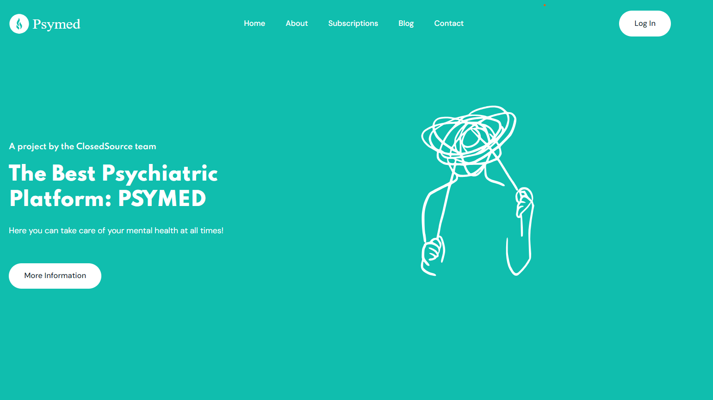
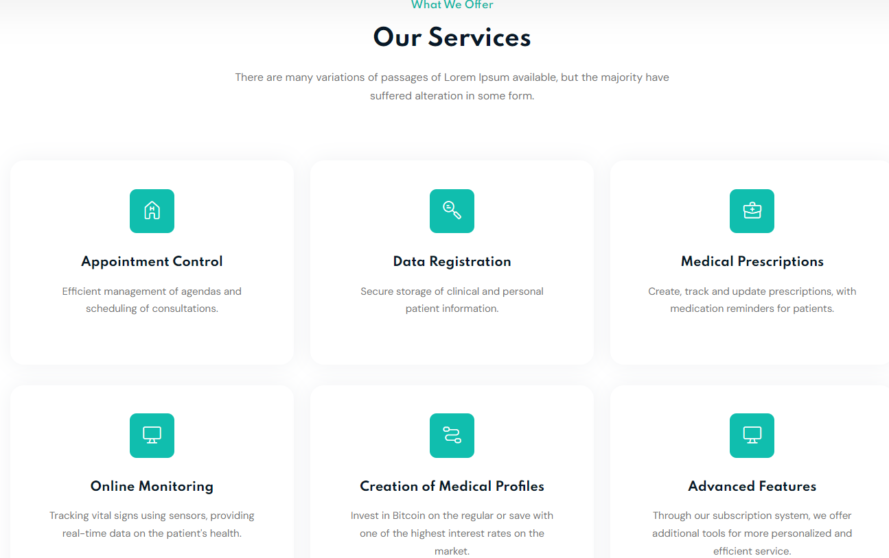
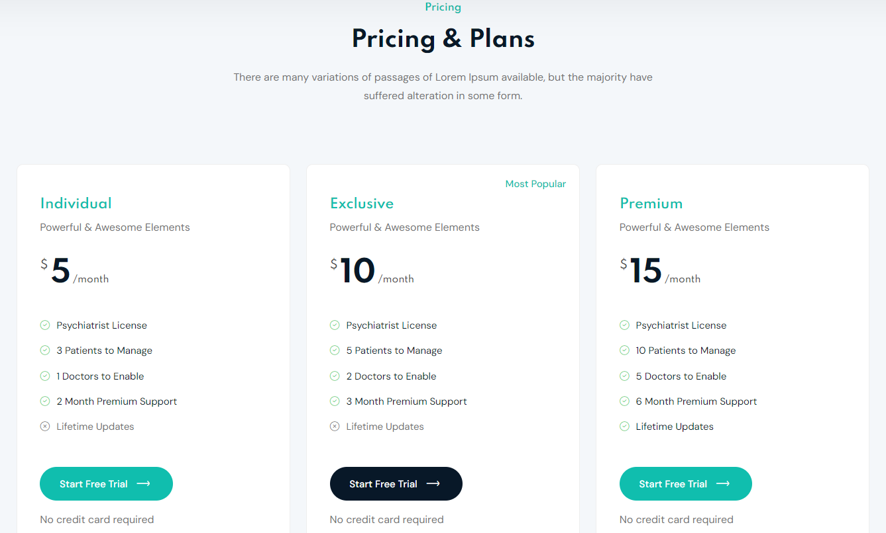

# Capítulo V: Product Implementation, Validation & Deployment

## 5.1 Software Configuration Management

### 5.1.1. Software Development Environment Configuration.

### 5.1.2. Source Code Management.

### 5.1.3. Source Code Style Guide & Conventions.

### 5.1.4. Software Deployment Configuration.

### 5.2. Landing Page, Services & Applications Implementation.

## 5.2. Landing Page, Services & Applications Implementation

### 5.2.1. Sprint 1

### 5.2.1.1. Sprint Planning 1

### 5.2.1.2. Sprint Backlog 1

### 5.2.1.3. Development Evidence for Sprint Review

### 5.2.1.4. Testing Suite Evidence for Sprint Review

Para la entrega de este primer Sprint se realizó el desarrollo de la Landing Page. Por ello, en esta sección se centro en la implementación de los archivos feature, basados en User Stories, que contiene nuestro landing page.

| Repository                   | Branch               | Commit Id | Commit Message                                          | Commit Message Body                                          | Committed on (Date) |
|------------------------------|----------------------|-----------|----------------------------------------------------------|---------------------------------------------------------------|----------------------|
| Aplicaciones-Webs-Grupo04 /Landing-Page_AppsWebs   | fix/index            | c5695a4   | fixed single-team                                        | Fixed single-team                                             | 07/09/2024           |
| Aplicaciones-Webs-Grupo04 /Landing-Page_AppsWebs   | fix/index            | e58327d   | fixed document not found error in the contact section     | Fixed document not found error in the contact section          | 03/09/2024           |
| Aplicaciones-Webs-Grupo04 /Landing-Page_AppsWebs   | fix/index            | 07282e0   | fixed error when sending a message in the contact section | Fixed error when sending a message in the contact section      | 03/09/2024           |
| Aplicaciones-Webs-Grupo04 /Landing-Page_AppsWebs   | fix/index            | ee8628d   | fixed error when searching for a file in the blog section | Fixed error when searching for a file in the blog section      | 03/09/2024           |
| Aplicaciones-Webs-Grupo04 /Landing-Page_AppsWebs   | docs/index           | 5b7ab99   | update comment for GLightbox                              | Update comment for GLightbox                                   | 03/09/2024           |
| Aplicaciones-Webs-Grupo04 /Landing-Page_AppsWebs   | feat/index           | bb5ab83   | add location map                                          | Add location map                                               | 03/09/2024           |
| Aplicaciones-Webs-Grupo04 /Landing-Page_AppsWebs   | feat/index           | 4f221fb   | add contact area                                          | Add contact area                                               | 03/09/2024           |
| Aplicaciones-Webs-Grupo04 /Landing-Page_AppsWebs   | feat/index           | d735878   | add content for .js files                                 | Add content for .js files                                      | 03/09/2024           |
| Aplicaciones-Webs-Grupo04 /Landing-Page_AppsWebs   | feat/index           | da888ff   | add footer area                                           | Add footer area                                                | 01/09/2024           |
| Aplicaciones-Webs-Grupo04 /Landing-Page_AppsWebs   | feat/index           | 5a3247b   | add header area                                           | Add header area                                                | 01/09/2024           |
| Aplicaciones-Webs-Grupo04 /Landing-Page_AppsWebs   | feat/main            | 1978884   | add preloader content                                     | Add preloader content - no preview                             | 01/09/2024           |

### 5.2.1.5. Execution Evidence for Sprint Review

Para este primer entregable, hemos elaborado la Landing Page del proyecto de "PsyMed". De tal modo, se podrá visualizar la información relevante sobre nuestra plataforma.

**Sección de Inicio**: Se implementó el Header y la página principal de nuestra Landing Page.

**Sección de Aplicación**: Se implementó la sección de la aplicación detallando el propósito de la misma.

**Sección de Servicios**: Se implementó la sección de los servicios ofrecidos.

**Sección de Planes**: Se implementó la sección de ver los tipos de suscripción.

**Sección de Creadores**: Se añadió la sección de información sobre los desarrolladores de la plataforma.

**Sección de About the Team**: Se implementó la sección del About the Team

### 5.2.1.6. Services Documentation Evidence for Sprint Review

### 5.2.1.7. Software Deployment Evidence for Sprint Review

# Conclusiones 

# Bibliografia
