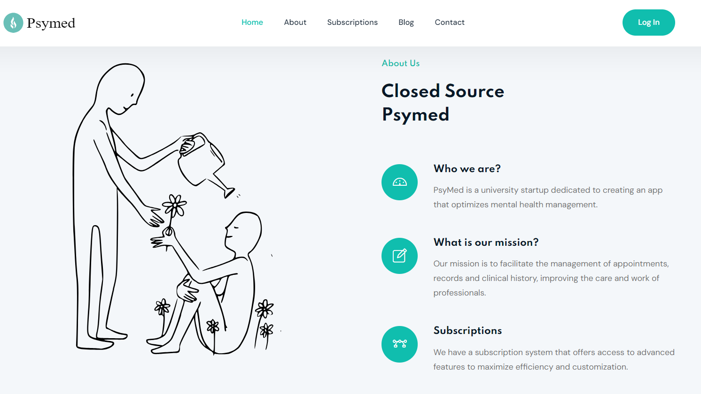
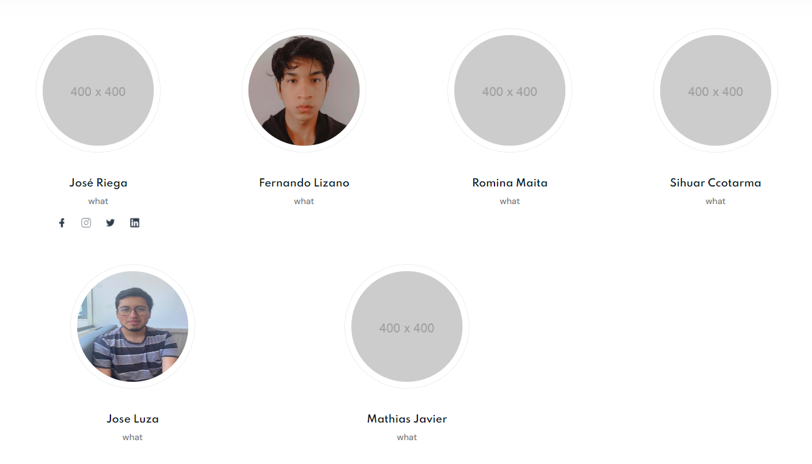

# Capítulo V: Product Implementation, Validation & Deployment

## 5.1 Software Configuration Management

### 5.1.1. Software Development Environment Configuration.

### 5.1.2. Source Code Management.

Landing Page Repository: [Landing Page Repository](https://github.com/Aplicaciones-Webs-Grupo04/Landing-Page_AppsWebs)
- #### GitFlow Implementation:
Para implementar el flujo de trabajo Gitflow utilizando Git como nuestra herramienta de control de versiones, nos basamos en la entrada de blog "A successful Git branching model" de Vincent Driessen. Esta referencia nos permitió establecer las convenciones detalladas que serán aplicadas en nuestro proyecto

### **Master o Main branch**
La rama principal de desarrollo del proyecto es la Master branch. En esta rama reside el código que actualmente se encuentra en producción.
#### Notación: master o main

### **Develop branch**
La rama "Develop" albergará las más recientes actualizaciones y cambios agregados que serán incluidos en la próxima versión del proyecto. Esta rama sirve como un espacio para la integración y prueba continua de los cambios antes de ser fusionados con la rama principal "Master" para su despliegue en producción.
#### Notación: develop

### **Release branch**
La rama de lanzamiento (Release branch) facilitará la preparación de una nueva versión del producto. Esta rama permitirá la corrección de errores y permitirá que la rama Develop reciba más actualizaciones.
 Debe derivarse de la rama Develop.
 Debe fusionarse con la rama Develop y Master.
#### Notación: release

### **Feature branch**
Las ramas de características (Feature branches) serán empleadas para desarrollar nuevas funcionalidades o características del producto que se agregarán en la siguiente versión o en versiones futuras. Estas funcionalidades deberán fusionarse eventualmente con la rama Develop.
 Debe derivarse de la rama Develop.
 Debe fusionarse de vuelta a la rama Develop.
#### Notación: release

### **Hotfix branch**
La rama de corrección rápida (Hotfix branch) se empleará para resolver y actuar de manera inmediata ante posibles errores en la versión en producción del producto. La característica principal de esta rama es que permite preparar una solución rápida mientras el resto del equipo continúa trabajando en otras funcionalidades o mejoras.
 Debe derivarse de la rama Master
 Debe fusionarse con la rama Develop y Master
#### Notación: hotfix

### **Conventional Commits**
"Conventional Commits" es una convención para estructurar los mensajes de confirmación (commits) en un formato estándar y semántico. Este formato ayuda a comunicar claramente los cambios realizados en el código y facilita la generación de registros de cambios automáticos. Los "Conventional Commits" suelen seguir un formato que incluye un encabezado, un cuerpo opcional y un pie de página opcional, y se utilizan para describir de manera sucinta y clara los cambios realizados en el código, lo que facilita su seguimiento y comprensión por parte de los desarrolladores y otros miembros del equipo.
 
La estructura de un commit debe seguir las siguientes pautas:
~~~
git commit -m “<type>[optional scope]: <title>“ -m “<description”
~~~
**Tipos De Conventional Commits**
~~~
1. **feat**: Se usa para describir una nueva característica o funcionalidad añadida al código.
2. **fix**: Indica una corrección de errores o solución a un problema.
3. **docs**: Se emplea para cambios o mejoras en la documentación del código.
4. **style**: Describe cambios relacionados con el formato del código, como espacios en blanco, sangrías, etc., que no afectan su funcionalidad.
5. **refactor**: Se utiliza para modificaciones en el código que no corrigen errores ni añaden nuevas funcionalidades, sino que mejoran su estructura o legibilidad.
6. **test**: Indica la adición o modificación de pruebas unitarias o funcionales.
7. **chore**: Se usa para cambios en el proceso de construcción o tareas de mantenimiento que no están directamente relacionadas con el código en sí.
8. **perf**: Describe mejoras de rendimiento en el código.
~~~

### 5.1.3. Source Code Style Guide & Conventions.

### 5.1.4. Software Deployment Configuration.

### 5.2. Landing Page, Services & Applications Implementation.

## 5.2. Landing Page, Services & Applications Implementation

### 5.2.1. Sprint 1

### 5.2.1.1. Sprint Planning 1

### 5.2.1.2. Sprint Backlog 1

### 5.2.1.3. Development Evidence for Sprint Review

### 5.2.1.4. Testing Suite Evidence for Sprint Review

Para la entrega de este primer Sprint se realizó el desarrollo de la Landing Page. Por ello, en esta sección se centro en la implementación de los archivos feature, basados en User Stories, que contiene nuestro landing page.

| Repository                   | Branch               | Commit Id | Commit Message                                          | Commit Message Body                                          | Committed on (Date) |
|------------------------------|----------------------|-----------|----------------------------------------------------------|---------------------------------------------------------------|----------------------|
| Aplicaciones-Webs-Grupo04 /Landing-Page_AppsWebs   | fix/index            | c5695a4   | fixed single-team                                        | Fixed single-team                                             | 07/09/2024           |
| Aplicaciones-Webs-Grupo04 /Landing-Page_AppsWebs   | fix/index            | e58327d   | fixed document not found error in the contact section     | Fixed document not found error in the contact section          | 03/09/2024           |
| Aplicaciones-Webs-Grupo04 /Landing-Page_AppsWebs   | fix/index            | 07282e0   | fixed error when sending a message in the contact section | Fixed error when sending a message in the contact section      | 03/09/2024           |
| Aplicaciones-Webs-Grupo04 /Landing-Page_AppsWebs   | fix/index            | ee8628d   | fixed error when searching for a file in the blog section | Fixed error when searching for a file in the blog section      | 03/09/2024           |
| Aplicaciones-Webs-Grupo04 /Landing-Page_AppsWebs   | docs/index           | 5b7ab99   | update comment for GLightbox                              | Update comment for GLightbox                                   | 03/09/2024           |
| Aplicaciones-Webs-Grupo04 /Landing-Page_AppsWebs   | feat/index           | bb5ab83   | add location map                                          | Add location map                                               | 03/09/2024           |
| Aplicaciones-Webs-Grupo04 /Landing-Page_AppsWebs   | feat/index           | 4f221fb   | add contact area                                          | Add contact area                                               | 03/09/2024           |
| Aplicaciones-Webs-Grupo04 /Landing-Page_AppsWebs   | feat/index           | d735878   | add content for .js files                                 | Add content for .js files                                      | 03/09/2024           |
| Aplicaciones-Webs-Grupo04 /Landing-Page_AppsWebs   | feat/index           | da888ff   | add footer area                                           | Add footer area                                                | 01/09/2024           |
| Aplicaciones-Webs-Grupo04 /Landing-Page_AppsWebs   | feat/index           | 5a3247b   | add header area                                           | Add header area                                                | 01/09/2024           |
| Aplicaciones-Webs-Grupo04 /Landing-Page_AppsWebs   | feat/main            | 1978884   | add preloader content                                     | Add preloader content - no preview                             | 01/09/2024           |

### 5.2.1.5. Execution Evidence for Sprint Review

Para este primer entregable, hemos elaborado la Landing Page del proyecto de "PsyMed". De tal modo, se podrá visualizar la información relevante sobre nuestra plataforma.

**Sección de Inicio**: Se implementó el Header y la página principal de nuestra Landing Page.

**Sección de Aplicación**: Se implementó la sección de la aplicación detallando el propósito de la misma.

**Sección de Servicios**: Se implementó la sección de los servicios ofrecidos.

**Sección de Planes**: Se implementó la sección de ver los tipos de suscripción.

**Sección de Creadores**: Se añadió la sección de información sobre los desarrolladores de la plataforma.

**Sección de About the Team**: Se implementó la sección del About the Team

### 5.2.1.6. Services Documentation Evidence for Sprint Review

En el presente sprint solo se desarrollo la Landing Page.

### 5.2.1.7. Software Deployment Evidence for Sprint Review

Para el despliegue de la Landing Page, utilizamos la herramienta GitHub Pages para realizar el deployment. Creamos un repositorio en el cual almacenamos el código de nuestra Landing Page.

Después de crear el repositorio, accedemos a la configuración y seleccionamos la sección de Pages. Allí, ingresamos los datos requeridos, como la fuente del branch que se utilizará para el deployment. Finalmente, GitHub Pages nos proporciona un enlace y publica nuestra Landing Page en la web.

### 5.2.1.8. Team Collaboration Insights during Sprint.

# Conclusiones 

# Bibliografia
